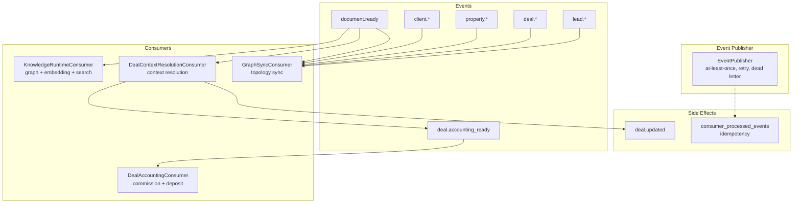
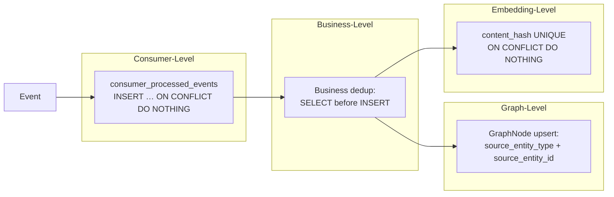

# Epic 3 — Event Driven Business Runtime: Architecture Freeze Record

> **Status:** FROZEN — no architectural changes without a new ADR
> **Date:** 2026-07-26
> **Author:** Architect RealtorOS
> **Context:** Epic 3 завершён. Все Stream 3 архитектурные решения приняты и реализованы.

---

## 1. Event Topology

Текущая схема Event Backbone — Business Events stream (Stream 3).



### Event Flow Detail

```
document.ready
  ├── GraphSyncConsumer        (topology: entity → GraphNode)
  ├── DealContextResolution    (client/property/participants resolution)
  │   └── deal.updated         (post-resolution update)
  │   └── deal.accounting_ready (when financial data is ready)
  │       └── DealAccountingConsumer (commission + deposit intent)
  └── KnowledgeRuntimeConsumer (graph node + embedding + search index)

client.* / property.* / deal.* / lead.* (all entity types)
  └── GraphSyncConsumer        (topology: entity → GraphNode)

consumer_processed_events     (idempotency dedup for all consumers)
```

### Delivery Characteristics

| Property | Value |
|----------|-------|
| Delivery | at-least-once (Publisher → Outbox) |
| Processing | effectively-once (consumer_processed_events dedup) |
| Retry | exponential backoff (1s → 2s → 4s, max 3) |
| Dead letter | after max_retries → status = 'dead' |
| Replay | via business_events table (append-only log) |
| Error isolation | consumer failure does NOT affect other consumers |

---

## 2. Consumer Ownership Matrix

| Consumer | Event Source | Responsibility | File |
|----------|-------------|----------------|------|
| **GraphSyncConsumer** | Все 14 event types (client.\*, property.\*, deal.\*, document.\*, lead.\*) | Entity → GraphNode sync (topology/navigation) | `backend/infrastructure/consumers/graph_sync_consumer.py` |
| **DealContextResolutionConsumer** | `document.ready` | Resolve client (INN/name), property (cadastral/address), participants → update Deal aggregate | `backend/infrastructure/consumers/deal_context_resolution_consumer.py` |
| **KnowledgeRuntimeConsumer** | `document.ready` | Knowledge runtime: graph node sync + embedding pipeline + search index trigger (semantic indexing) | `backend/infrastructure/consumers/knowledge_runtime_consumer.py` |
| **DealAccountingConsumer** | `deal.accounting_ready` | Accounting intent: commission (62/90) + deposit (51/76) → AccountingDocument in READY status | `backend/infrastructure/consumers/deal_accounting_consumer.py` |

### Consumer Registration (from `backend/main.py`)

```
EventPublisher.register_consumer("document.ready", GraphSyncConsumer)
EventPublisher.register_consumer("document.ready", DealContextResolutionConsumer)
EventPublisher.register_consumer("document.ready", KnowledgeRuntimeConsumer)
EventPublisher.register_consumer("deal.accounting_ready", DealAccountingConsumer)
```

---

## 3. ADR Index

### Stream 3 — Business Events (Foundation)

| ADR | Decision | Status | Stream |
|-----|----------|--------|--------|
| Stream 3 ADR | IntegrationEvent, Outbox, Publisher, Consumer | ✅ Accepted | Stream 3 |

### Deal Context Resolution (DCR)

| ADR | Decision | Status | Stream |
|-----|----------|--------|--------|
| DCR ADR-001 | New `DealContextResolutionConsumer` (not extend `GraphSyncConsumer`) | ✅ Accepted | DCR |
| DCR ADR-002 | `Client.inn` VARCHAR(12) + partial unique index (`WHERE inn IS NOT NULL`) | ✅ Accepted | DCR |
| DCR ADR-003 | `Property.cadastral_number` VARCHAR + partial unique index (`WHERE cadastral_number IS NOT NULL`) | ✅ Accepted | DCR |
| DCR ADR-004 | Reuse `CandidateFinder` for search (not rewrite) — search ≠ decision | ✅ Accepted | DCR |
| DCR ADR-005 | Confidence-based resolution: RESOLVED / AMBIGUOUS / NOT_FOUND — never guess and link | ✅ Accepted | DCR |
| DCR ADR-006 | Deal update through `DealApplicationService` (not direct SQL in consumer) | ✅ Accepted | DCR |

### Knowledge Runtime (KR)

| ADR | Decision | Status | Stream |
|-----|----------|--------|--------|
| KR ADR-001 | One `KnowledgeRuntimeConsumer` (not three separate: GraphSync + Embedding + Search) | ✅ Accepted | KR |
| KR ADR-002 | `document.ready` as Source of Truth — consumer loads data from DB, not from event payload | ✅ Accepted | KR |
| KR ADR-003 | Embedding Ownership: Consumer orchestrates via `EmbeddingPipeline` service (not direct embedder calls) | ✅ Accepted | KR |
| KR ADR-004 | Idempotency — 3 levels: consumer_processed_events, content_hash UNIQUE, source_entity upsert | ✅ Accepted | KR |
| KR ADR-005 | `DocumentReadyPayload` contract — frozen dataclass with `document_id`, `profile`, `source` | ✅ Accepted | KR |

### Accounting Event Integration (ACC)

| ADR | Decision | Status | Stream |
|-----|----------|--------|--------|
| ACC ADR-001 | `DealAccountingConsumer` — new consumer, not extending existing ones | ✅ Accepted | ACC |
| ACC ADR-002 | `deal.accounting_ready` event — not `deal.updated` (decoupled, fires only on financial readiness) | ✅ Accepted | ACC |
| ACC ADR-003 | `AccountingBinding` as canonical target — all new integration targets `services/accounting_binding/` | ✅ Accepted | ACC |
| ACC ADR-004 | `deal_id` + `source_event_id` + `source_type` correlation on `AccountingDocument` | ✅ Accepted | ACC |
| ACC ADR-005 | Posting scope: commission + deposit ONLY — Phase 1 creates AccountingDocument in READY status, no posting | ✅ Accepted | ACC |

### Total: 17 ADR (1 Stream 3 + 6 DCR + 5 KR + 5 ACC)

---

## 4. Delivery Guarantees

### 4.1 Delivery Semantics

| Guarantee | Mechanism | Implementation |
|-----------|-----------|----------------|
| **Delivery** | At-least-once | Publisher writes to `business_events` table → Outbox pattern → consumer delivery with retry |
| **Processing** | Effectively-once | `consumer_processed_events` table — dedup by `(consumer_name, event_id)` via `INSERT ... ON CONFLICT DO NOTHING` |
| **Retry** | Exponential backoff | 1s → 2s → 4s, max 3 retries per event |
| **Dead letter** | Terminal state | After max_retries exceeded → `consumer_processed_events.status = 'dead'` |
| **Replay** | Append-only log | Events in `business_events` table can be replayed by clearing `consumer_processed_events` rows |
| **Error isolation** | Per-consumer boundaries | Consumer failure does not affect other consumers — each has independent retry/dedup state |

### 4.2 Idempotency Architecture



- **Level 1 — Consumer dedup** (all consumers): `consumer_processed_events(consumer_name, event_id)` — synchronous psycopg2 check before processing
- **Level 2 — Business dedup** (DealAccountingConsumer): check `(deal_id, document_type)` before creating AccountingDocument
- **Level 3 — Graph dedup** (GraphSyncConsumer, KnowledgeRuntimeConsumer): `source_entity_type + source_entity_id` upsert
- **Level 4 — Content dedup** (KnowledgeRuntimeConsumer): `content_hash UNIQUE` constraint on embeddings

### 4.3 Retry Policy

```python
retry_policy = {
    "max_retries": 3,
    "backoff_base_seconds": 1,
    "backoff_multiplier": 2,     # 1 → 2 → 4
    "dead_letter_after": "max_retries_exceeded",
}
```

---

## 5. Tech Debt Register (Deferred)

| ID | Item | Risk | Proposed Solution | Priority |
|----|------|------|-------------------|----------|
| TD-001 | **ConsumerStateRepository — sync psycopg2** | Event loop blocking under concurrent load | Migrate to async SQLAlchemy session (aligned with app pattern) | Medium |
| TD-002 | **Dual Search Architecture** (legacy FTS + embedding hybrid) | Maintenance burden, inconsistent results | Consolidation ADR — unify search behind a single abstraction | High |
| TD-003 | **Dual Accounting Systems** (legacy `services/accounting/` + `services/accounting_binding/`) | Data inconsistency, dual-write risk | Legacy → AccountingBinding migration (Phase 2 / Compliance Stream) | High |
| TD-004 | **KnowledgeRuntimeIntegrator — dead code** | Confusion for new developers, dead imports | Remove or wire properly (currently not wired) | Low |
| TD-005 | **consumer_processed_events unbounded growth** | Storage bloat over time, slow dedup queries | TTL / partitioning / archive job for processed rows | Medium |
| TD-006 | **GraphSyncConsumer — session bug** | `GraphLifecycleService()` created without `session` → `AttributeError` | Fixed in KR phase — track as debt: fragile constructor pattern | Low |

### Tech Debt Rationale

All items above were identified during Epic 3 implementation and deliberately deferred. None blocks current functionality. Each has a proposed solution but was outside Phase 1 scope.

---

## 6. Migration Boundaries

Clearly documented boundaries — what is NOT covered by Epic 3.

| Component | Status | Rationale |
|-----------|--------|-----------|
| **Legacy accounting** (`backend/services/accounting/`) | ❌ NOT migrated | Remains for read/reporting only. New writes go to `services/accounting_binding/` |
| **Legacy graph handler** (`graph_sync_handler` in `event_handlers.py`) | ❌ Removed | Replaced by `GraphSyncConsumer` — handler code removed from `event_handlers.py` |
| **Dual search** | ❌ NOT consolidated | Legacy FTS and embedding hybrid search remain separate; consolidation deferred to separate ADR |
| **KnowledgeRuntimeIntegrator** | ❌ NOT wired | Dead code — identified but not wired in Phase 1 (TD-004) |
| **Accounting posting** (JournalEntry → Ledger) | ❌ Phase 2 | Epic 3 completes only AccountingDocument creation in READY status |
| **Approval workflow** | ❌ Phase 2 | No approval gate in Epic 3; deferred to Compliance Stream |

---

## 7. Freeze Tags

```
epic3-stream3-business-events-complete
epic3-deal-context-resolution-complete
epic3-knowledge-runtime-integration-complete
epic3-accounting-event-integration-complete
```

### Tag Semantics

| Tag | Meaning |
|-----|---------|
| `epic3-stream3-business-events-complete` | Stream 3 (Business Events) — IntegrationEvent, Outbox, Publisher, Consumer base — реализованы и замёрзнуты |
| `epic3-deal-context-resolution-complete` | DealContextResolutionConsumer — idempotent, confidence-based deal enrichment — реализован |
| `epic3-knowledge-runtime-integration-complete` | KnowledgeRuntimeConsumer — graph node + embedding + search index — реализован |
| `epic3-accounting-event-integration-complete` | DealAccountingConsumer — intent creation (commission + deposit) — реализован |

### Change Procedure

Любое архитектурное изменение в рамках frozen boundary требует нового ADR:

1. **Single-consumer change** → RFC (within stream)
2. **Cross-consumer change** → ADR (architecture-wide)
3. **Platform contract change** → ADR (affects all streams)

---

*End of Epic 3 Architecture Freeze Record*
