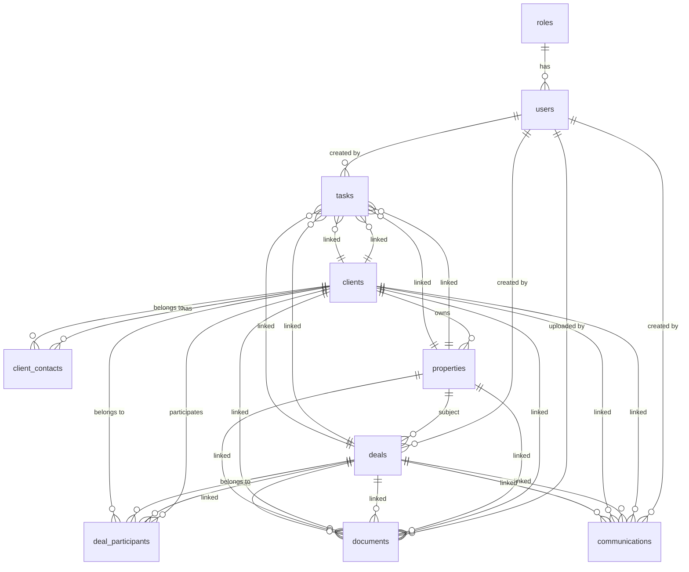

# Real Estate OS — Canonical Domain Model

## Business Areas

The system supports five primary business areas:

1. **Real Estate Brokerage** — Full-service agency operations
2. **Property Sales** — Buying and selling residential and commercial property
3. **Daily Rentals** — Short-term vacation rentals and temporary housing
4. **Long-term Rentals** — Residential and commercial lease agreements
5. **Commercial Real Estate** — Business property transactions

## Core Entities

### 1. User (Пользователь)

**Purpose:** System administrator, real estate agent, or support staff member.

**Attributes:**
- `id` — UUID primary key
- `role_id` — FK to Role (admin, agent, manager, support)
- `status` — active, inactive, blocked
- `full_name` — string, required
- `phone` — string, unique
- `email` — string, unique
- `telegram_id` — string, unique
- `telegram_username` — string
- `telegram_chat_id` — string
- `password_hash` — string, required
- `avatar` — string (URL)
- `settings` — JSONB (user preferences)
- `last_login` — timestamp
- `created_at`, `updated_at` — timestamps

**Relationships:**
- Has one Role
- Creates Tasks
- Creates Communications
- Uploads Documents
- Manages Deals (as deal creator or deal participant agent)
- Assigned to Communications

**Indexes:**
- `role_id` — role-based filtering
- `status` — active user filtering
- `telegram_id` — Telegram integration
- `phone`, `email` — authentication

---

### 2. Client (Клиент)

**Purpose:** Individual or legal entity interacting with the agency.

**Attributes:**
- `id` — UUID primary key
- `type` — buyer, seller, tenant, landlord, investor, partner
- `status` — lead, active, inactive, archived, blacklisted
- `full_name` — string, required
- `phone` — string, unique
- `email` — string, optional
- `telegram_id` — string, optional
- `telegram_username` — string, optional
- `source` — referral, site, telegram, call, other
- `notes` — text
- `tags` — string array
- `created_at`, `updated_at` — timestamps

**Relationships:**
- Has many ClientContact (additional contact persons for legal entities)
- Has many Properties (as owner)
- Has many DealParticipant (as participant)
- Has many Communications
- Has many Documents
- Has many Tasks

**Indexes:**
- `type + status` — filter by client type and status
- `phone` — unique search
- `telegram_id` — Telegram lookup
- `source` — lead source analytics

**Extensibility:**
- Future: `legal_entity_type` for corporate clients
- Future: `preferred_languages` for communication localization
- Future: `loyalty_tier` for CRM scoring

---

### 3. ClientContact (Контактное лицо)

**Purpose:** Additional contact persons for corporate clients or multi-person households.

**Attributes:**
- `id` — UUID primary key
- `client_id` — FK to Client (cascade delete)
- `full_name` — string, required
- `phone` — string, optional
- `email` — string, optional
- `position` — string (e.g., "CEO", "Account Manager" for legal entities)
- `is_primary` — boolean, default false
- `notes` — text
- `created_at`, `updated_at` — timestamps

**Relationships:**
- Belongs to Client

**Indexes:**
- `client_id` — client contact lookup
- `is_primary` — primary contact filtering

**Extensibility:**
- Future: `email_verified` for corporate contacts
- Future: `communication_preference` (email vs phone vs Telegram)

---

### 4. Property (Объект недвижимости)

**Purpose:** The central asset being bought, sold, or rented.

**Attributes:**
- `id` — UUID primary key
- `property_type` — apartment, house, commercial, land, townhouse, penthouse
- `status` — available, under_contract, sold, rented, archived, removed
- `deal_type` — sale, rent_short, rent_long, commercial
- `title` — string, required
- `description` — text
- `address` — string, required
- `area_total` — decimal (total area in m²)
- `area_living` — decimal (living area in m², optional)
- `rooms` — integer (optional)
- `floor` — integer (optional)
- `floors_total` — integer (optional)
- `price` — decimal (price or rent amount)
- `price_currency` — string (RUB, USD, EUR)
- `price_per_meter` — decimal (computed field)
- `commission` — decimal (agency commission amount)
- `owner_id` — FK to Client (optional, for owned properties)
- `photos` — string array (URLs)
- `documents` — string array (URLs)
- `notes` — text
- `created_at`, `updated_at` — timestamps

**Relationships:**
- Belongs to Client (owner)
- Has many Deals (as property in deal)
- Has many Documents (property documents)
- Has many Tasks (property-related tasks)

**Indexes:**
- `status + deal_type` — active property filtering
- `property_type` — type-based search
- `address` — full-text search
- `price` — price-based sorting
- `owner_id` — owner's properties
- `area_total`, `rooms` — area/room filtering

**Extensibility:**
- Future: `latitude`, `longitude` for map visualization
- Future: `building_type` (panel, brick, monolith)
- Future: `year_built`, `renovation_type`
- Future: `parking`, `elevator`, `security`
- Future: `amenities` — JSONB (pool, gym, concierge, etc.)

---

### 5. Deal (Сделка)

**Purpose:** The central transaction record linking clients and properties.

**Attributes:**
- `id` — UUID primary key
- `deal_type` — sale, rent_short, rent_long, commercial
- `status` — negotiation, contract_signing, deposit, legal_check, payment, closed, cancelled
- `property_id` — FK to Property (required)
- `title` — string (auto-generated: "Purchase {address}")
- `description` — text
- `price` — decimal (deal price)
- `price_currency` — string
- `commission` — decimal (agency commission)
- `commission_percent` — float (computed from price)
- `deposit_amount` — decimal (optional, for sale/rent)
- `start_date` — date (required)
- `end_date` — date (optional, for rent)
- `closing_date` — date (deal closure)
- `source` — referral, site, direct, other
- `notes` — text
- `created_by` — FK to User (required)
- `created_at`, `updated_at` — timestamps

**Relationships:**
- Belongs to Property
- Has many DealParticipant (participants)
- Has many Documents (deal documents)
- Has many Communications (deal communications)
- Has many Tasks (deal tasks)
- Created by User

**Indexes:**
- `status + deal_type` — active deal filtering
- `property_id` — property's deals
- `client_id` (via DealParticipant) — client's deals
- `start_date`, `closing_date` — date-based reporting

**Extensibility:**
- Future: `currency_conversion_rate` for multi-currency deals
- Future: `payment_schedule` — JSONB (installments)
- Future: `valuation_date` — for price history

---

### 6. DealParticipant (Участник сделки)

**Purpose:** Roles of clients in a specific deal.

**Attributes:**
- `id` — UUID primary key
- `deal_id` — FK to Deal (cascade delete)
- `client_id` — FK to Client (required)
- `role` — buyer, seller, tenant, landlord, agent, witness
- `created_at`, `updated_at` — timestamps

**Relationships:**
- Belongs to Deal
- Belongs to Client

**Indexes:**
- `deal_id` — deal participants
- `client_id` — client's deals
- `role` — role-based filtering (e.g., all buyers)

**Extensibility:**
- Future: `commission_split` — JSONB (commission distribution)
- Future: `contact_person_id` — FK to ClientContact

---

### 7. Document (Документ)

**Purpose:** Any file or document related to a client, property, or deal.

**Attributes:**
- `id` — UUID primary key
- `document_type` — contract, passport, extract, deed, receipt, statement, photo, video, report, other
- `status` — pending, received, verified, expired, rejected
- `title` — string, required
- `description` — text
- `file_name` — string, required
- `file_path` — string, required
- `file_size` — bigint (bytes)
- `file_hash` — string (SHA-256)
- `mime_type` — string
- `client_id` — FK to Client (optional)
- `property_id` — FK to Property (optional)
- `deal_id` — FK to Deal (optional)
- `uploaded_by` — FK to User (required)
- `expiry_date` — date (optional)
- `notes` — text
- `created_at`, `updated_at` — timestamps

**Relationships:**
- Linked to Client (optional)
- Linked to Property (optional)
- Linked to Deal (optional)
- Uploaded by User

**Indexes:**
- `client_id`, `property_id`, `deal_id` — document lookup by context
- `document_type + status` — document workflow filtering
- `uploaded_by` — user's uploaded documents
- `expiry_date` — expiring documents

**Extensibility:**
- Future: `document_category` — JSONB (for custom categories)
- Future: `metadata` — JSONB (custom document fields)
- Future: `version` — for document revision tracking

---

### 8. Communication (Коммуникация)

**Purpose:** Any interaction record with a client or deal participant.

**Attributes:**
- `id` — UUID primary key
- `communication_type` — call, email, telegram, whatsapp, meeting, site_message, note
- `direction` — incoming, outgoing
- `client_id` — FK to Client (optional, nullable)
- `deal_id` — FK to Deal (optional, nullable)
- `subject` — string (email/Telegram subject)
- `content` — text, required
- `duration` — integer (seconds, for calls)
- `contact` — string (phone/email/telegram username)
- `assigned_to` — FK to User (optional)
- `is_important` — boolean
- `tags` — string array
- `created_by` — FK to User (required)
- `created_at`, `updated_at` — timestamps

**Relationships:**
- Belongs to Client (optional, nullable)
- Belongs to Deal (optional, nullable)
- Created by User
- Assigned to User (optional)

**Constraint:**
- At least one of `client_id` or `deal_id` must be filled.

**Indexes:**
- `client_id` — client communication history
- `deal_id` — deal communications
- `communication_type + created_at` — feed by type
- `assigned_to` — user's assigned communications
- `is_important` — important communications

**Extensibility:**
- Future: `media_attachments` — string array (for calls with recordings)
- Future: `follow_up_required` — boolean
- Future: `translation` — JSONB (for multi-language communications)

---

### 9. Task (Задача)

**Purpose:** Action items for real estate agents.

**Attributes:**
- `id` — UUID primary key
- `title` — string, required
- `description` — text
- `status` — pending, in_progress, completed, cancelled
- `priority` — low, medium, high, critical
- `task_type` — other, call, email, meeting, inspection, contract, payment
- `client_id` — FK to Client (optional)
- `deal_id` — FK to Deal (optional)
- `property_id` — FK to Property (optional)
- `assigned_to` — FK to User (required)
- `created_by` — FK to User (required)
- `due_date` — timestamp (optional)
- `completed_at` — timestamp
- `completed_by` — FK to User
- `reminder` — timestamp
- `notes` — text
- `tags` — string array
- `created_at`, `updated_at` — timestamps

**Relationships:**
- Assigned to User
- Created by User
- Linked to Client (optional)
- Linked to Deal (optional)
- Linked to Property (optional)

**Indexes:**
- `assigned_to + status` — user's pending tasks
- `due_date` — overdue and upcoming tasks
- `client_id`, `deal_id`, `property_id` — context-based task filtering
- `priority` — critical/high priority filtering

**Extensibility:**
- Future: `recurring` — boolean (for recurring tasks)
- Future: `subtasks` — JSONB (for multi-step tasks)
- Future: `estimated_hours` — float
- Future: `actual_hours` — float (for time tracking)

---

### 10. Role (Роль)

**Purpose:** System role definitions with permissions.

**Attributes:**
- `id` — UUID primary key
- `name` — string, unique (admin, agent, manager, support)
- `permissions` — JSONB (array of permission codes)
- `description` — text
- `is_system` — boolean (cannot be deleted)
- `created_at`, `updated_at` — timestamps

**Relationships:**
- Has many Users

**Indexes:**
- `name` — role lookup

**Extensibility:**
- Future: `inherit_permissions_from` — FK to Role (for hierarchical roles)
- Future: `created_by` — FK to User (for custom roles)

---

## Entity Relationships (Mermaid ER Diagram)

---

## Relationship Summary

### One-to-Many
- `User` creates `Task`, `Communication`, `Document`, `Deal`
- `Client` has many `ClientContact`, `Property`, `DealParticipant`, `Communication`, `Document`, `Task`
- `Property` has many `Deal`, `Document`, `Task`
- `Deal` has many `DealParticipant`, `Document`, `Communication`, `Task`
- `Document` linked to `Client`, `Property`, `Deal` (one document can be linked to multiple contexts)
- `Communication` linked to `Client`, `Deal` (one communication can be linked to multiple contexts)

### Many-to-Many
- `DealParticipant` links `Deal` and `Client` (many-to-many via junction table)
- `Task` can be linked to `Client`, `Deal`, `Property` simultaneously

### Self-Referencing
- None (relationships are explicit and normalized)

---

## Database Schema (PostgreSQL)

See `docs/domain/entities.md` for complete DDL with constraints, indexes, and data types.

---

## Future Extensibility Notes

### 1. Property Enhancements
- **Location data:** Add `latitude`, `longitude` for map integration
- **Building details:** `building_type`, `year_built`, `renovation_type`
- **Amenities:** JSONB field for pool, gym, concierge, parking
- **Media:** Expand `photos` to `media` with categorization (interior, exterior, video)

### 2. Deal Enhancements
- **Payment scheduling:** JSONB for installment plans
- **Currency handling:** Multi-currency deals with conversion rates
- **Deal stages:** More granular stages (negotiation → offer → counter-offer → deposit → legal → closing)

### 3. Communication Enhancements
- **Media attachments:** Call recordings, video messages
- **Translation:** Multi-language communication history
- **Templates:** Predefined communication templates

### 4. Task Enhancements
- **Recurring tasks:** Auto-generate follow-up tasks
- **Time tracking:** Estimated vs actual hours
- **Subtasks:** Nested task structure
- **Checklists:** For inspection or contract preparation

### 5. Client Enhancements
- **Corporate clients:** `legal_entity_type`, `registration_number`
- **Loyalty program:** `loyalty_tier`, `points_balance`
- **Preferences:** `communication_preference`, `preferred_languages`

### 6. Document Enhancements
- **Metadata:** Custom fields per document type
- **Versioning:** Track document revisions
- **Categorization:** JSONB for custom document categories

### 7. AI Integration
- **Document extraction:** AI-powered document parsing (contracts, passports)
- **Lead scoring:** ML-based lead prioritization
- **Communication analysis:** Sentiment analysis, follow-up suggestions

---

## Design Principles

1. **Never invent entities** — Use existing entities before creating new ones.
2. **Never create duplicate models** — Use relationships and junction tables.
3. **Read domain model before coding** — Always reference this document.
4. **Normalization first** — Relationships are explicit; avoid circular dependencies.
5. **Extensibility via JSONB** — Use JSONB for flexible, non-structural fields.

---

## Related Documentation

- `docs/domain/entities.md` — Complete PostgreSQL DDL with constraints
- `docs/architecture/overview.md` — High-level architecture
- `docs/development_rules.md` — Development guidelines
- `docs/roadmap/mvp.md` — MVP feature roadmap
