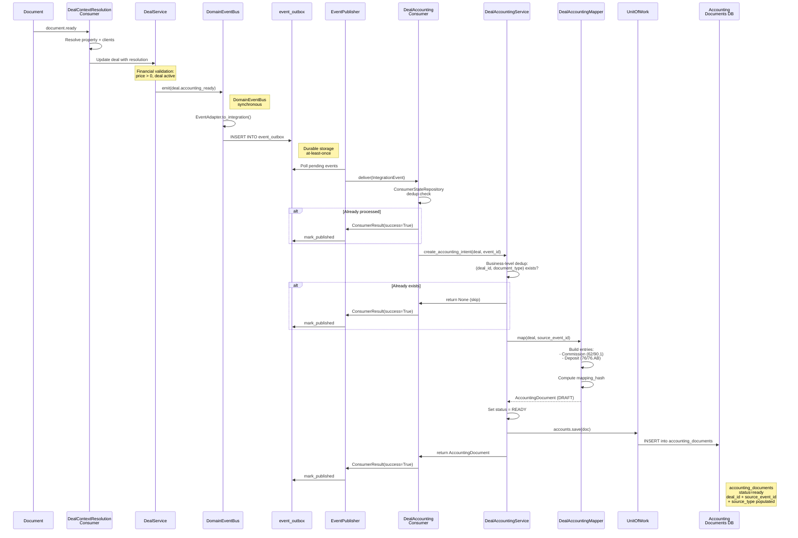

# Accounting Event Integration — Phase 1 Design Proposal

**Date:** 2025-07-26
**Branch:** `feature/accounting-event-integration`
**Status:** Draft
**Author:** Architecture (Phase 1)
**Architecture Discussion:** APPROVED — 5 ADR

---

## Table of Contents

1. [Motivation](#1-motivation)
2. [Architecture Decisions](#2-architecture-decisions)
3. [Event Contract](#3-event-contract)
4. [Component Design](#4-component-design)
5. [Data Flow](#5-data-flow)
6. [Schema Changes](#6-schema-changes)
7. [Scope Guard](#7-scope-guard)
8. [Delivery Guarantees](#8-delivery-guarantees)
9. [Definition of Done](#9-definition-of-done)
10. [Exit Criteria](#10-exit-criteria)
11. [Decision Log](#11-decision-log)

---

## 1. Motivation

### The Gap

Phase 0 Discovery (`docs/epics/epic3/accounting-event-integration/current-accounting-event-flow.md`) identified a critical architectural gap: **there is no bridge between Deal and Accounting**.

```
[Document.ready] → [DealContextResolution] → [Deal.updated] → ❌ NO ACCOUNTING CONSUMER
```

Current state:
- **Deal exists** in `backend/models/deal.py` with financial fields: `price`, `commission`, `deposit_amount`
- **Accounting Binding exists** in `services/accounting_binding/` with `AccountingDocument`, `JournalEntry`, full pipeline
- **Event Backbone exists** in `backend/core/` with `DomainEventBus`, `EventPublisher`, `BaseConsumer`
- **Bridge does NOT exist** — no consumer, mapper, or pipeline connects Deal financials to Accounting

### Why Phase 1

Deal financial data (price, commission, deposit) must enter the accounting system as `AccountingDocument` records. Without this:
- No audit trail for deal-related financials
- No compliance (commissions, deposits not tracked)
- No explainability for deal → accounting lineage
- No replay capability for deal accounting events

Phase 1 establishes the bridge: **intent creation only** — `AccountingDocument` in `READY` status, ready for future posting by the Compliance/Accounting Stream.

---

## 2. Architecture Decisions

### ADR-001: Accounting consumer reacts to accounting-specific events

**Status:** ACCEPTED

**Context:** `deal.updated` fires for many reasons (address change, status transition, description edit). An accounting consumer on `deal.updated` would re-process on every irrelevant update.

**Decision:** Define a new dedicated event `deal.accounting_ready` emitted specifically when deal financial data is ready for accounting processing.

**Flow:**
```
DocumentReady → DealContextResolution → Deal.updated
                                             ↓
                                    Financial validation
                                             ↓
                                    deal.accounting_ready
                                             ↓
                                    DealAccountingConsumer
```

**Consequences:**
- `deal.accounting_ready` fires only when financial data is ready
- No false triggers on non-financial updates
- Requires explicit emit point in `DealService` or a new orchestrator

**Rationale:** Decouples accounting processing cadence from deal update cadence. An accounting-specific event allows the consumer to be triggered independently of `deal.updated`.

---

### ADR-002: Accounting Binding is the canonical accounting runtime

**Status:** ACCEPTED

**Context:** Two accounting systems exist:
1. `backend/services/accounting/` — legacy synchronous psycopg2 (read/reporting)
2. `services/accounting_binding/` — new async DDD with contracts, domain, infrastructure

**Decision:** All new deal → accounting integration targets `services/accounting_binding/`. Legacy `backend/services/accounting/` remains untouched for read/reporting only.

**Consequences:**
- New consumers, mappers, and persistence use accounting_binding infrastructure
- Legacy accounting is NOT migrated in Phase 1
- accounting_binding tables (`accounting_documents`, `journal_entries`) are the canonical store
- Dual-write concern acknowledged but deferred to Phase 2/Compliance Stream

**Rationale:** accounting_binding already has async SQLAlchemy, domain contracts, idempotent posting, and transactional outbox. Building in the legacy system would perpetuate synchronous psycopg2 and compound the migration problem.

---

### ADR-003: AccountingDocument must have deal correlation

**Status:** ACCEPTED

**Context:** Current `AccountingDocument` (Pydantic contract, line 74) and `AccountingDocumentRecord` (SQLAlchemy, line 45) have NO `deal_id` field. This makes it impossible to:
- Trace which deal generated an accounting document
- Replay events per deal
- Audit deal → accounting lineage
- Support compliance queries ("show all accounting for deal X")

**Decision:** Add `deal_id`, `source_event_id`, and `source_type` to both the Pydantic contract and ORM record.

**New fields on `AccountingDocument` (contract):**
```python
deal_id: str = ""                  # UUID of the source deal
source_event_id: str = ""          # UUID of the deal.accounting_ready event
source_type: str = ""              # Event type that triggered creation ("deal.accounting_ready")
```

**New columns on `AccountingDocumentRecord` (ORM):**
```python
deal_id: Mapped[str] = mapped_column(String(36), default="", index=True)
source_event_id: Mapped[str] = mapped_column(String(36), default="", index=True)
source_type: Mapped[str] = mapped_column(String(64), default="", index=True)
```

**Consequences:**
- New migration required (`002_add_deal_correlation.py`)
- `AccountingDocumentMapper` must map the new fields
- All `AccountingDocument` creation sites must supply these fields
- Backward compatible (default `""`) — existing documents unaffected
- `source_type` enables event-type filtering and audit traceability

**Rationale:** Without deal correlation, the accounting system is a black box. Deal_id is the minimum viable correlation for audit, replay, and compliance.

---

### ADR-004: Phase 1 completes intent creation, not posting

**Status:** ACCEPTED

**Context:** The full accounting flow would be:
```
Deal → AccountingDocument (READY) → Approval → JournalEntry → Ledger
```

**Decision:** Phase 1 creates `AccountingDocument` in status `READY` only. Posting (Approval → JournalEntry → Ledger) is Phase 2 (Compliance/Accounting Stream).

**Consequences:**
- No `JournalEntry` creation in Phase 1
- No approval workflow in Phase 1
- No ledger posting in Phase 1
- `AccountingDocument.status = READY` signals "ready for posting"
- Phase 2 reads `READY` documents and runs approval → posting

**Rationale:** Separating intent creation from posting allows each to be designed, tested, and deployed independently. Phase 1 establishes the data pipeline; Phase 2 establishes the compliance gate. This aligns with incremental delivery.

---

### ADR-005: Exactly-once semantics via idempotency key

**Status:** ACCEPTED

**Context:** The Event Backbone provides at-least-once delivery. Without idempotency guard, a retried event would create duplicate `AccountingDocument` records.

**Decision:** Two-layer idempotency:

1. **Consumer-level dedup** (existing): `BaseConsumer` + `ConsumerStateRepository` checks `consumer_processed_events` table by `(consumer_name, event_id)`. Same pattern as `DealContextResolutionConsumer`.

2. **Business-level dedup** (new): Create a unique constraint or hash check on `(deal_id, document_type)` to prevent duplicate intent creation even if the consumer dedup fails.

```python
# Consumer-level (existing — inherited from BaseConsumer)
consumer_processed_events(consumer_name, event_id) → skip if present

# Business-level (new — in DealAccountingService)
Is there already a READY AccountingDocument for (deal_id, document_type)?
  → YES: skip (idempotent return)
  → NO: create new READY document
```

**Consequences:**
- Consumer dedup catches most duplicates (event_id stable across retries)
- Business dedup catches edge cases (replay, manual re-trigger)
- Business dedup uses a simple `SELECT` before insert — no unique constraint needed
- `source_event_id` on `AccountingDocument` provides additional traceability

**Rationale:** Two-layer guard is standard for financial systems. Consumer dedup is fast (synchronous psycopg2 check). Business dedup protects against semantic duplicates (same deal retriggered with different event_ids).

---

## 3. Event Contract

### 3.1 New Event Type

```python
# backend/core/domain_events.py — add:
EVENT_DEAL_ACCOUNTING_READY = "deal.accounting_ready"
```

### 3.2 Event Payload Schema

When emitted, `deal.accounting_ready` carries:

```python
payload = {
    "deal_id": "uuid-string",            # Deal UUID (stable business ID)
    "price": 5000000.00,                 # Deal price (RUB)
    "commission": 50000.00,              # Commission amount (RUB)
    "deposit_amount": 100000.00,         # Deposit amount (RUB)
    "deal_type": "sale",                 # Deal type classification
    "price_currency": "RUB",             # Currency
    "document_ids": ["uuid-1", "uuid-2"],# Related document UUIDs
    "source": "promote_to_deal",         # Event source
}
```

### 3.3 IntegrationEvent Envelope

When emitted through the durable Event Backbone:

| Field | Value |
|-------|-------|
| `event_type` | `"deal.accounting_ready"` |
| `aggregate_type` | `"Deal"` |
| `aggregate_id` | `str(deal.id)` |
| `payload` | As above |
| `metadata.producer` | `"deal_service"` |
| `metadata.schema_version` | `1` |

### 3.4 Emit Point

The event is emitted from `backend/services/deal_service.py` after:
1. Deal financial fields are confirmed populated (price > 0)
2. Deal context resolution completes (property + clients resolved)
3. The deal is in a valid financial state

**Emit logic** (in `DealService` or new orchestrator):

```python
from backend.core.domain_events import DomainEvent, get_event_bus

async def emit_accounting_ready(self, deal: Deal) -> None:
    """Emit deal.accounting_ready when deal financials are ready."""
    event = DomainEvent(
        event_type=EVENT_DEAL_ACCOUNTING_READY,
        entity_type="deal",
        entity_id=deal.id,
        actor_id="system",
        payload={
            "deal_id": str(deal.id),
            "price": deal.price,
            "commission": deal.commission or 0.0,
            "deposit_amount": deal.deposit_amount or 0.0,
            "deal_type": deal.deal_type,
            "price_currency": deal.price_currency,
            "document_ids": [str(d.id) for d in deal.documents],
            "source": "deal_service",
        },
    )
    await get_event_bus().emit(event)
```

---

## 4. Component Design

### 4.1 DealAccountingConsumer

**File:** `backend/infrastructure/consumers/deal_accounting_consumer.py`

**Pattern:** Extends `BaseConsumer` (same as `DealContextResolutionConsumer`).

**Triggers on:** `deal.accounting_ready` IntegrationEvent.

**Responsibilities:**
1. Extract `deal_id` and financial data from event payload
2. Check consumer-level dedup (via `BaseConsumer`)
3. Load Deal from DB to get fresh financial state
4. Delegate to `DealAccountingService` for intent creation
5. Handle idempotent return (already processed → skip)
6. Log success/failure

```python
"""DealAccountingConsumer — consumes deal.accounting_ready → creates accounting intent."""

from uuid import UUID

from sqlalchemy import select
from sqlalchemy.ext.asyncio import async_sessionmaker
from structlog import get_logger

from backend.core.integration_event import IntegrationEvent
from backend.infrastructure.consumer_base import BaseConsumer, ConsumerResult
from backend.models.deal import Deal
from services.accounting_binding.infrastructure.uow import UnitOfWork
from services.accounting_binding.infrastructure.connection_provider import (
    create_async_session,
)

logger = get_logger(__name__)


class DealAccountingConsumer(BaseConsumer):
    """Consumes deal.accounting_ready → creates AccountingDocument (READY).

    Phase 1 only: creates intent, does NOT post.
    Idempotent via consumer_processed_events + business-level dedup.
    """

    consumer_name = "deal_accounting"

    def __init__(
        self,
        dsn: str,
        session_factory: async_sessionmaker,
        accounting_dsn: str,  # accounting_binding DB connection
    ) -> None:
        super().__init__(consumer_name=self.consumer_name, dsn=dsn)
        self._session_factory = session_factory
        self._accounting_dsn = accounting_dsn

    async def _process(self, event: IntegrationEvent) -> None:
        """Process a deal.accounting_ready event."""
        deal_id_str = event.payload.get("deal_id")
        if not deal_id_str:
            logger.error("deal_accounting_missing_deal_id", event_id=str(event.event_id))
            return

        deal_id = UUID(str(deal_id_str))

        # 1. Load Deal from main DB
        async with self._session_factory() as session:
            result = await session.execute(
                select(Deal).where(Deal.id == deal_id)
            )
            deal = result.scalar_one_or_none()
            if deal is None:
                logger.error("deal_accounting_deal_not_found", deal_id=str(deal_id))
                return

            # 2. Create AccountingDocument via DealAccountingService
            from backend.services.deal_accounting_service import DealAccountingService

            accounting_session = create_async_session(self._accounting_dsn)
            async with UnitOfWork(accounting_session) as uow:
                service = DealAccountingService(
                    uow=uow,
                    deal=deal,
                    source_event_id=event.event_id,
                )
                doc = await service.create_accounting_intent()

                if doc is not None:
                    await uow.commit()
                    logger.info(
                        "deal_accounting_intent_created",
                        deal_id=str(deal_id),
                        document_id=doc.document_id,
                        status=doc.status.value,
                    )
                else:
                    logger.info(
                        "deal_accounting_intent_skipped_idempotent",
                        deal_id=str(deal_id),
                    )
```

### 4.2 DealAccountingService (Orchestrator)

**File:** `backend/services/deal_accounting_service.py`

**Role:** Orchestrates the creation of accounting intent for a deal. Located in `backend/services/` because it bridges backend (deal data) with accounting_binding (persistence).

**Responsibilities:**
1. Business-level idempotency check: `(deal_id, document_type)`
2. Map deal financials to `AccountingDocument` via `DealAccountingMapper`
3. Set status to `READY` (intent creation complete)
4. Save via `UnitOfWork`

```python
"""DealAccountingService — orchestrates accounting intent creation for a deal."""

from __future__ import annotations

from uuid import UUID

from structlog import get_logger

from backend.models.deal import Deal
from services.accounting_binding.contracts.accounting_document import (
    AccountingDocument,
    DocumentStatus,
)
from backend.services.deal_accounting_mapper import DealAccountingMapper
from services.accounting_binding.infrastructure.uow import UnitOfWork

logger = get_logger(__name__)


class DealAccountingService:
    """Orchestrator: Deal financials → AccountingDocument (READY).

    Phase 1: creates intent only, does NOT post.
    Business-level idempotency: skips if (deal_id, document_type) already exists.
    """

    def __init__(
        self,
        uow: UnitOfWork,
        deal: Deal,
        source_event_id: UUID,
    ) -> None:
        self._uow = uow
        self._deal = deal
        self._source_event_id = str(source_event_id)

    async def create_accounting_intent(self) -> AccountingDocument | None:
        """Create or skip accounting intent for a deal.

        Returns:
            AccountingDocument if created, None if idempotent skip.
        """
        deal_id = str(self._deal.id)
        document_type = "deal_accounting"

        # Business-level idempotency check
        existing = await self._check_existing_intent(deal_id, document_type)
        if existing:
            logger.info(
                "deal_accounting_intent_exists",
                deal_id=deal_id,
                document_id=existing.document_id,
            )
            return None

        # Map deal financials to accounting entries
        mapper = DealAccountingMapper()
        accounting_doc = mapper.map(
            deal=self._deal,
            source_event_id=self._source_event_id,
            document_type=document_type,
        )

        # Set status to READY (intent created)
        doc = accounting_doc.model_copy(
            update={"status": DocumentStatus.READY}
        )

        # Persist
        await self._uow.accounts.save(doc)
        logger.info(
            "deal_accounting_intent_persisted",
            deal_id=deal_id,
            document_id=doc.document_id,
            total_debit=str(doc.total_debit),
            total_credit=str(doc.total_credit),
            entries_count=len(doc.entries),
        )
        return doc

    async def _check_existing_intent(
        self, deal_id: str, document_type: str
    ) -> AccountingDocument | None:
        """Check if an accounting intent already exists for this deal.

        Business-level idempotency: if (deal_id, document_type) already
        exists in READY status, skip creation.
        """
        # Note: Phase 1 uses a simple lookup. Future: add repository method.
        from services.accounting_binding.infrastructure.models.accounting_document_record import (
            AccountingDocumentRecord,
        )
        from sqlalchemy import select, and_

        session = self._uow._session
        result = await session.execute(
            select(AccountingDocumentRecord).where(
                and_(
                    AccountingDocumentRecord.deal_id == deal_id,
                    AccountingDocumentRecord.document_type == document_type,
                    AccountingDocumentRecord.status.in_(
                        ["ready", "draft"]
                    ),
                )
            )
        )
        record = result.scalar_one_or_none()
        if record is None:
            return None

        from services.accounting_binding.infrastructure.mappers.accounting_document_mapper import (
            AccountingDocumentMapper,
        )
        return AccountingDocumentMapper.record_to_domain(record)
```

### 4.3 DealAccountingMapper

**File:** `backend/services/deal_accounting_mapper.py`

**Role:** Maps `Deal` model fields → `AccountingDocument` with accounting entries.

**Mapping Rules (Phase 1):**

| Deal Field | Accounting Treatment | Account Code | Side |
|------------|---------------------|--------------|------|
| `commission` | Commission revenue accrual | 62 → 90.1 | DEBIT / CREDIT |
| `deposit_amount` | Deposit received | 76 → 76.AB | DEBIT / CREDIT |

```python
"""DealAccountingMapper — maps Deal financials to AccountingDocument entries.

Phase 1: simple hardcoded account codes based on deal_type.
Future: AccountBook protocol resolution with proper chart of accounts.
"""

from __future__ import annotations

from datetime import date
from decimal import Decimal
from uuid import uuid4

from structlog import get_logger

from backend.models.deal import Deal
from services.accounting_binding.contracts.accounting_document import (
    AccountingDocument,
    AccountEntry,
    AccountingSide,
    DocumentStatus,
    ProcessingState,
)
from services.accounting_binding.contracts.normalized_document import (
    DocumentType,
)
from services.accounting_binding.domain.hash import canonical_hash

logger = get_logger(__name__)


class DealAccountingMapper:
    """Maps Deal → AccountingDocument with accounting entries."""

    DEAL_ACCOUNTING_DOC_TYPE = "deal_accounting"

    def map(
        self,
        deal: Deal,
        source_event_id: str,
        document_type: str = DEAL_ACCOUNTING_DOC_TYPE,
    ) -> AccountingDocument:
        """Create an AccountingDocument from deal financials.

        Args:
            deal: The Deal model with financial fields.
            source_event_id: The event_id that triggered this mapping.
            document_type: Accounting document type classification.

        Returns:
            AccountingDocument with entries in status DRAFT
            (caller sets to READY after validation).
        """
        deal_id = str(deal.id)
        price = Decimal(str(deal.price))
        commission = Decimal(str(deal.commission or 0))
        deposit = Decimal(str(deal.deposit_amount or 0))

        entries: list[AccountEntry] = []

        # 1. Commission receivable (Дт 62 / Кт 90.1)
        if commission > 0:
            entries.append(
                AccountEntry(
                    account_code="62",   # Дебиторская задолженность
                    side=AccountingSide.DEBIT,
                    amount=commission,
                    dimension=f"deal:{deal_id}",
                    description=f"Комиссия агента по сделке {deal_id}",
                    sequence=0,
                )
            )
            entries.append(
                AccountEntry(
                    account_code="90.1", # Выручка от продаж
                    side=AccountingSide.CREDIT,
                    amount=commission,
                    dimension=f"deal:{deal_id}",
                    description=f"Начисление комиссии по сделке {deal_id}",
                    sequence=1,
                )
            )

        # 2. Deposit tracking (Дт 76 / Кт 76.AB) — if deposit exists
        if deposit > 0:
            entries.append(
                AccountEntry(
                    account_code="76",   # Прочие дебиторы/кредиторы
                    side=AccountingSide.DEBIT,
                    amount=deposit,
                    dimension=f"deal:{deal_id}",
                    description=f"Депозит по сделке {deal_id}",
                    sequence=2,
                )
            )
            entries.append(
                AccountEntry(
                    account_code="76.AB", # Авансы полученные
                    side=AccountingSide.CREDIT,
                    amount=deposit,
                    dimension=f"deal:{deal_id}",
                    description=f"Депозит к зачёту по сделке {deal_id}",
                    sequence=3,
                )
            )

        # 3. No price entries in Phase 1 — price is not an accounting operation.
        #    Commission and deposit are the only posted amounts.

        # Calculate totals
        total_debit = sum(
            (e.amount for e in entries if e.side == AccountingSide.DEBIT),
            Decimal("0"),
        )
        total_credit = sum(
            (e.amount for e in entries if e.side == AccountingSide.CREDIT),
            Decimal("0"),
        )

        # Compute idempotency hash
        mapping_hash = self._compute_hash(deal, entries)

        doc_id = str(uuid4())

        return AccountingDocument(
            document_id=doc_id,
            document_type=DocumentType(dict(
                deal_accounting="contract",
            ).get(document_type, "contract")),
            document_date=date.today(),
            deal_id=deal_id,
            source_event_id=source_event_id,
            source_type="deal.accounting_ready",
            source="deal_service",
            company_id=str(deal.created_by),  # Agent as company context
            entries=entries,
            total_debit=total_debit,
            total_credit=total_credit,
            mapping_hash=mapping_hash,
            status=DocumentStatus.DRAFT,  # Caller sets READY
            process_state=ProcessingState.PENDING,
        )

    def _compute_hash(
        self, deal: Deal, entries: list[AccountEntry]
    ) -> str:
        """Canonical hash for idempotency.

        Uses deal_id + document_type + entries content.
        Does NOT include timestamp or document_id.
        """
        payload = {
            "deal_id": str(deal.id),
            "document_type": self.DEAL_ACCOUNTING_DOC_TYPE,
            "entries": [
                {
                    "account_code": e.account_code,
                    "side": e.side.value,
                    "amount": str(e.amount),
                    "dimension": e.dimension,
                }
                for e in sorted(entries, key=lambda x: x.sequence)
            ],
        }
        return canonical_hash(payload)
```

---

## 5. Data Flow



### Flow Summary (Text)

```
1. document.ready → DealContextResolutionConsumer
   - Resolves property + client entities
   - Updates Deal

2. DealService (after resolution):
   - Validates financial data (price > 0)
   - Emits deal.accounting_ready via DomainEventBus
   - EventAdapter converts to IntegrationEvent
   - INSERT into event_outbox table

3. EventPublisher polls event_outbox:
   - Finds pending deal.accounting_ready event
   - Delivers to DealAccountingConsumer.consume()

4. DealAccountingConsumer:
   - Checks consumer_processed_events (dedup)
   - Loads Deal from DB (fresh state)
   - Calls DealAccountingService.create_accounting_intent()

5. DealAccountingService:
   - Checks business-level dedup: (deal_id, document_type)
   - Maps deal financials via DealAccountingMapper
   - Persists AccountingDocument (status=READY)
   - Returns result

6. AccountingDocument stored in accounting_binding DB:
   - deal_id + source_event_id populated
   - status = READY (ready for future posting)
   - entries contain commission, deposit mappings
```

---

## 6. Schema Changes

### 6.1 AccountingDocument Contract (Pydantic)

**File:** `services/accounting_binding/contracts/accounting_document.py`

Add to `AccountingDocument` class:

```python
class AccountingDocument(BaseModel):
    # ... existing fields ...
    
    # NEW: Deal correlation (Phase 1)
    deal_id: str = Field(default="", description="UUID source deal")
    source_event_id: str = Field(default="", description="UUID of triggering event")
    source_type: str = Field(default="", description="Event type that triggered creation")
    
    model_config = {"frozen": True, "extra": "forbid"}
```

### 6.2 AccountingDocumentRecord (SQLAlchemy)

**File:** `services/accounting_binding/infrastructure/models/accounting_document_record.py`

Add columns:

```python
class AccountingDocumentRecord(Base):
    __tablename__ = "accounting_documents"
    
    # ... existing columns ...
    
    # NEW: Deal correlation (Phase 1 — added by migration 002)
    deal_id: Mapped[str] = mapped_column(
        String(36), default="", index=True, nullable=False
    )
    source_event_id: Mapped[str] = mapped_column(
        String(36), default="", index=True, nullable=False
    )
    source_type: Mapped[str] = mapped_column(
        String(64), default="", index=True, nullable=False
    )
```

### 6.3 Migration: 002_add_deal_correlation.py

**File:** `services/accounting_binding/infrastructure/migrations/versions/002_add_deal_correlation.py`

```python
"""Add deal_id and source_event_id to accounting_documents."""

from alembic import op
import sqlalchemy as sa

revision = "002_add_deal_correlation"
down_revision = "001_initial"
branch_labels = None
depends_on = None


def upgrade() -> None:
    op.add_column(
        "accounting_documents",
        sa.Column("deal_id", sa.String(36), default="", index=True),
    )
    op.add_column(
        "accounting_documents",
        sa.Column("source_event_id", sa.String(36), default="", index=True),
    )
    op.add_column(
        "accounting_documents",
        sa.Column("source_type", sa.String(64), default="", index=True),
    )


def downgrade() -> None:
    raise NotImplementedError("Forward-only migration")
```

### 6.4 AccountingDocumentMapper Updates

**File:** `services/accounting_binding/infrastructure/mappers/accounting_document_mapper.py`

```python
# In domain_to_record():
AccountingDocumentRecord(
    # ... existing ...
    deal_id=doc.deal_id,
    source_event_id=doc.source_event_id,
    source_type=doc.source_type,
)

# In record_to_domain():
AccountingDocument(
    # ... existing ...
    deal_id=record.deal_id or "",
    source_event_id=record.source_event_id or "",
    source_type=record.source_type or "",
)
```

### 6.5 Domain Event Constant

**File:** `backend/core/domain_events.py`

```python
# Add after existing event constants:
EVENT_DEAL_ACCOUNTING_READY = "deal.accounting_ready"
```

---

## 7. Scope Guard

### ✅ In Scope — Phase 1

| # | Item | Delivered As |
|---|------|-------------|
| 1 | `EVENT_DEAL_ACCOUNTING_READY` constant | `backend/core/domain_events.py` |
| 2 | `deal.accounting_ready` emit point | `DealService` or orchestrator |
| 3 | `DealAccountingConsumer` on `deal.accounting_ready` | `backend/infrastructure/consumers/` |
| 4 | Consumer registration in `backend/main.py` | Lifespan startup |
| 5 | `DealAccountingService` (orchestrator) | `backend/services/` |
| 6 | `DealAccountingMapper` (deal → entries) | `backend/services/` |
| 7 | `deal_id` + `source_event_id` + `source_type` on `AccountingDocument` | Contract + ORM + migration |
| 8 | Business-level idempotency (`deal_id`, `document_type`) | `DealAccountingService` |
| 9 | Consumer-level dedup (existing `BaseConsumer` pattern) | Inherited |
| 10 | AccountingDocument persistence (status `READY`) | Via `UnitOfWork` |
| 11 | Tests: unit + integration | `backend/tests/` |
| 12 | Documentation | This document |

### ❌ Out of Scope — Phase 1

| # | Item | Phase |
|---|------|-------|
| 1 | Automatic posting / JournalEntry creation | Phase 2 (Compliance Stream) |
| 2 | Approval workflow | Phase 2 (Compliance Stream) |
| 3 | Period closing integration | Future Phase |
| 4 | Payment schedule / installment tracking | Future Phase |
| 5 | Commission calculation engine (`commission_percent`) | Future Phase |
| 6 | Legacy accounting (`backend/services/accounting/`) migration | Future Phase |
| 7 | Tax engine (VAT, tax mapping) | Future Phase |
| 8 | Dual-write to legacy accounting tables | Deferred |
| 9 | Accounting Binding full pipeline (enrich → validate → approve → post) | Phase 2 |
| 10 | `OutboxRecord` in accounting_binding outbox | Phase 2 (posting) |

---

## 8. Delivery Guarantees

### 8.1 Event Delivery

| Guarantee | Mechanism | Details |
|-----------|-----------|---------|
| **At-least-once** | `EventPublisher` polls `event_outbox` | Events remain `pending` until all consumers succeed |
| **Ordering** | No ordering guarantee | Events can be processed in any order (business-level idempotency handles reorder) |
| **Retry** | Exponential backoff: 1s → 2s → 4s | Configurable via `EventPublisher.backoff_base` |
| **Dead letter** | After 3 attempts → `status='dead'` | Logged as error, requires manual intervention |

### 8.2 Idempotency

| Layer | Scope | Mechanism | Recovery |
|-------|-------|-----------|----------|
| **Consumer** | Same event_id | `ConsumerStateRepository`: `(consumer_name, event_id)` | `ON CONFLICT DO NOTHING` |
| **Business** | Same deal + doc_type | `DealAccountingService`: check `(deal_id, document_type, status=READY\|DRAFT)` | Existing record returned, no duplicate |

### 8.3 Transactional Consistency

| Operation | Transaction Boundary | Rollback Behavior |
|-----------|---------------------|-------------------|
| Consumer dedup check | Synchronous psycopg2 (separate connection) | Not transactional with main flow — safe because ON CONFLICT DO NOTHING |
| Deal load | Async SQLAlchemy session | Part of consumer's session scope |
| AccountingDocument save | `UnitOfWork` async commit | Rollback on any exception → event retried |

### 8.4 Error Scenarios

| Scenario | Behavior | Recovery |
|----------|----------|----------|
| Deal not found | Log error, do NOT mark processed | Message stays in outbox as failed → retries → dead letter after 3 attempts |
| DB connection lost | Exception → consumer returns failure | Retry picks up event on next poll cycle |
| Duplicate event (consumer dedup) | Skip immediately, return success | Event marked published |
| Duplicate event (business dedup) | Skip, return success via idempotent return | Event marked published |
| Mapping failure | Exception → rollback → retry | Same event retried at next poll |
| Accounting DB down | Exception → rollback → retry | Retry with backoff |

---

## 9. Definition of Done

### 9.1 Code Complete

- [ ] `EVENT_DEAL_ACCOUNTING_READY` constant defined in `backend/core/domain_events.py`
- [ ] `deal.accounting_ready` emit point implemented in `DealService` or orchestrator
- [ ] `DealAccountingConsumer` extends `BaseConsumer`, implements `_process()`
- [ ] Consumer registered in `backend/main.py` lifespan on `deal.accounting_ready`
- [ ] `DealAccountingService` with business-level idempotency check
- [ ] `DealAccountingMapper` maps commission, deposit → entries
- [ ] `AccountingDocument` contract extended with `deal_id`, `source_event_id`, `source_type`
- [ ] `AccountingDocumentRecord` ORM extended with `deal_id`, `source_event_id`, `source_type`
- [ ] Migration `002_add_deal_correlation.py` created
- [ ] `AccountingDocumentMapper` updated for new fields
- [ ] AccountingDocument saved with `status=READY`

### 9.2 Tests Passing

- [ ] Unit test: `DealAccountingMapper.map()` produces correct entries for sale deal
- [ ] Unit test: `DealAccountingMapper.map()` handles zero commission/deposit
- [ ] Unit test: `DealAccountingService.create_accounting_intent()` creates READY document
- [ ] Unit test: Business dedup returns None on duplicate `(deal_id, document_type)`
- [ ] Unit test: Consumer dedup via `ConsumerStateRepository.is_processed`
- [ ] Integration test: Full `deal.accounting_ready` → `AccountingDocument` in DB
- [ ] Integration test: Idempotent re-delivery does not create duplicate
- [ ] Test: Event emit → outbox → publisher → consumer flow

### 9.3 Documentation

- [ ] This proposal document reviewed and approved
- [ ] Inline docstrings on all new classes and methods
- [ ] Event contract documented in `domain_events.py`
- [ ] Flow diagram in this document up-to-date

### 9.4 Reviews

- [ ] Architecture review: 5 ADR approved
- [ ] Code review: all new files reviewed
- [ ] Schema review: migration reviewed

---

## 10. Exit Criteria

Phase 1 is complete and ready to hand off when:

### 10.1 Functional

1. A deal is created (via promote-to-deal or other flow)
2. `deal.accounting_ready` event is emitted when financial data is valid
3. `DealAccountingConsumer` processes the event
4. An `AccountingDocument` record appears in `accounting_documents` table with:
   - `deal_id` = UUID of the source deal
   - `source_event_id` = UUID of the triggering event
   - `status = 'ready'`
   - Non-empty `entries_json` with commission, deposit entries
5. Re-delivery of the same event produces no duplicate records
6. All tests pass

### 10.2 Non-Functional

1. No impact on existing `document.ready` → `DealContextResolutionConsumer` flow
2. No changes to legacy `backend/services/accounting/`
3. No changes to existing `AccountingDocument` records (backward compatible)
4. Consumer startup does not block FastAPI app startup (graceful fail)
5. Consumer failure does not crash the event publisher

### 10.3 Verification

```python
# Verification SQL (run after test):
SELECT id, deal_id, source_event_id, status, total_debit, total_credit
FROM accounting_documents
WHERE deal_id = '<test_deal_uuid>'
  AND status = 'ready';
-- Expected: 1 row, non-empty deal_id, non-empty source_event_id

SELECT * FROM consumer_processed_events
WHERE consumer_name = 'deal_accounting'
  AND event_id = '<test_event_uuid>';
-- Expected: 1 row (consumer dedup recorded)
```

---

## 11. Decision Log

| # | Decision | Rationale | Alternatives Considered |
|---|----------|-----------|------------------------|
| ADR-001 | New `deal.accounting_ready` event | Decoupled from generic `deal.updated`; triggers only on financial readiness | `deal.updated` filtered by payload; rejected: fragile, violates separation of concerns |
| ADR-002 | accounting_binding is canonical runtime | Async, DDD, contracts, idempotent posting already built | Legacy accounting sync psycopg2; rejected: would perpetuate sync bottleneck |
|| ADR-003 | `deal_id` + `source_event_id` + `source_type` on AccountingDocument | Minimum viable correlation for audit, replay, compliance | Only `deal_id`; rejected: can't trace which event created the document |
| ADR-004 | Phase 1 = intent creation only | Incremental delivery; Stage 1 establishes data pipeline | Full pipeline (intent → approve → post); rejected: too much risk per phase |
| ADR-005 | Two-layer idempotency (consumer + business) | Financial correctness requires defense-in-depth | Single consumer dedup; rejected: business dedup protects against replay scenarios |

### Open Questions

1. **Emit timing:** Should `deal.accounting_ready` be emitted by `DealService` after resolution, or by a new orchestrator that monitors deal state? *Current preference: `DealService` with explicit call.*

2. **Account codes:** Phase 1 uses hardcoded Russian chart-of-accounts codes (62, 76, 90.1). Should these be configurable? *Deferred to Phase 2 when AccountBook protocol integration is done.*

3. **Multi-currency:** Price has `price_currency` but entries are in RUB. How should currency conversion be handled? *Deferred — Phase 1 assumes RUB only.*

4. **Commission calculation:** `commission_percent` exists on Deal model but `commission` is always 0.0. Should Phase 1 include simple percent-based calculation? *No — deferred. Phase 1 maps whatever is stored on Deal.*

### Design Constraints

- **No dual-write to legacy accounting** in Phase 1
- **No changes to existing DomainEventBus** beyond new constant
- **No changes to existing consumer registration pattern** in main.py
- **All new code is async** (consistent with FastAPI stack)
- **Backward compatible schema changes** (default values for existing rows)

---

## Appendix A: File Inventory

### New Files

| File | Purpose |
|------|---------|
| `backend/infrastructure/consumers/deal_accounting_consumer.py` | Consumer on `deal.accounting_ready` |
| `backend/services/deal_accounting_service.py` | Orchestrator: idempotency + persistence |
| `backend/services/deal_accounting_mapper.py` | Deal → AccountingDocument mapping |
| `services/accounting_binding/infrastructure/migrations/versions/002_add_deal_correlation.py` | Schema migration |

### Modified Files

| File | Change |
|------|--------|
| `backend/core/domain_events.py` | Add `EVENT_DEAL_ACCOUNTING_READY` constant |
| `backend/main.py` | Register `DealAccountingConsumer` on `deal.accounting_ready` |
|| `services/accounting_binding/contracts/accounting_document.py` | Add `deal_id`, `source_event_id`, `source_type` fields |
|| `services/accounting_binding/infrastructure/models/accounting_document_record.py` | Add `deal_id`, `source_event_id`, `source_type` columns |
|| `services/accounting_binding/infrastructure/mappers/accounting_document_mapper.py` | Map new fields domain ↔ record |

### Deferred (Future Phases)

| File | Phase |
|------|-------|
| `services/accounting_binding/domain/accounting_intent/` | Phase 2 — accounting intent domain logic |
| `services/accounting_binding/api/routes/accounting_intent.py` | Phase 2 — intent review/approve endpoints |

---

## Appendix B: Test Plan

### Unit Tests

| Test | File |
|------|------|
| `test_deal_accounting_mapper::test_map_sale_deal` | `backend/tests/unit/test_deal_accounting_mapper.py` |
| `test_deal_accounting_mapper::test_map_zero_commission` | Same |
| `test_deal_accounting_mapper::test_map_zero_deposit` | Same |
| `test_deal_accounting_mapper::test_map_all_zero` | Same |
| `test_deal_accounting_mapper::test_mapping_hash_stable` | Same |
| `test_deal_accounting_service::test_create_intent` | `backend/tests/unit/test_deal_accounting_service.py` |
| `test_deal_accounting_service::test_idempotent_skip` | Same |
| `test_deal_accounting_consumer::test_process_event` | `backend/tests/unit/test_deal_accounting_consumer.py` |
| `test_deal_accounting_consumer::test_consumer_dedup` | Same |

### Integration Tests

| Test | File |
|------|------|
| `test_deal_accounting_flow::test_event_to_document` | `backend/tests/integration/test_deal_accounting_flow.py` |
| `test_deal_accounting_flow::test_idempotent_delivery` | Same |
| `test_deal_accounting_flow::test_missing_deal` | Same |
