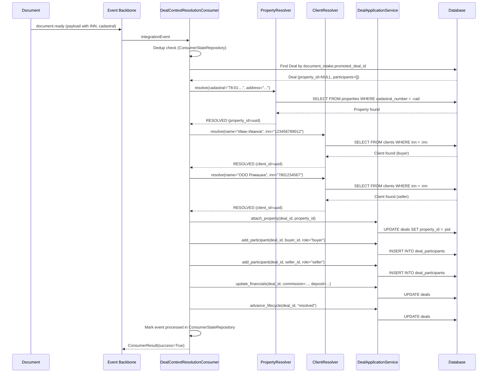
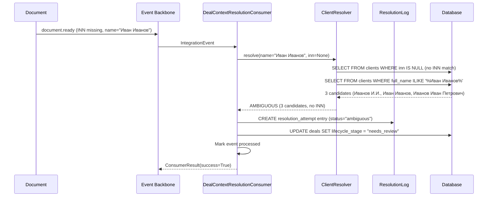
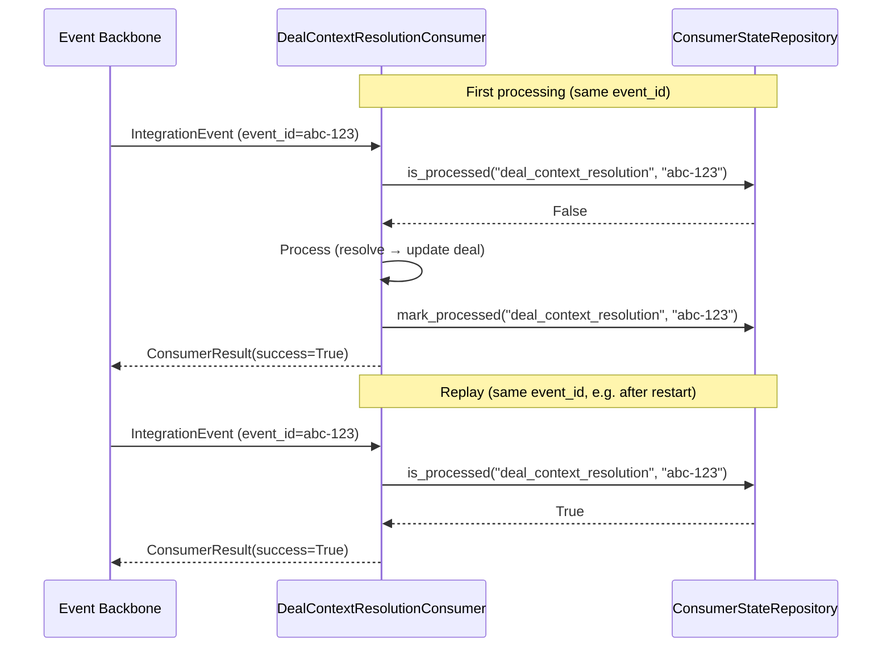

# Deal Context Resolution — Phase 1 Design Proposal

> **Branch:** `feature/deal-context-resolution`
> **Date:** 2026-07-26
> **Author:** Architect RealtorOS
> **Status:** Proposed
> **Base:** `master` (epic3-stream3-business-events-complete merged)

---

## 1. Motivation

### 1.1 The Problem

After `POST /documents/{id}/promote-to-deal`, the newly created Deal is a **skeleton** with critical gaps:

| Field | After promote_to_deal | Desired |
|-------|----------------------|---------|
| `property_id` | `NULL` | Resolved Property UUID |
| `participants` | `[]` (no DealParticipant rows) | Buyer + Seller DealParticipant rows |
| `commission` | `0.0` | Derived from contract profile |
| `deposit_amount` | `0.0` | Extracted from contract profile |
| `lifecycle_stage` | `deal_candidate` | Should progress after resolution |

The structured `document.ready` event carries **all the data needed** to fill these gaps: buyer/seller names with INN, cadastral number, address, financial terms. But **no consumer listens** for `document.ready` to perform this enrichment.

### 1.2 Why a New Consumer

The existing `GraphSyncConsumer` consumes `document.ready` for one purpose only — syncing documents to the Knowledge Graph. Knowledge representation (graph sync) and business aggregate enrichment (deal context resolution) are **different bounded concerns**. Combining them would create a God Consumer that conflates infrastructure sync with domain logic.

### 1.3 What Phase 1 Delivers

Phase 1 delivers an **idempotent, confidence-based Deal Context Resolution pipeline**:

```
document.ready → DealContextResolutionConsumer → Resolution Services → Deal Update
```

After processing:
- `deal.property_id` is set to a resolved or created Property
- `DealParticipant` rows exist for buyer and seller (linked to resolved or created Clients)
- Replaying the same event produces identical state (idempotent)

---

## 2. Architecture Decisions

### 2.1 ADR-001: DealContextResolutionConsumer

| Attribute | Value |
|-----------|-------|
| **Status** | Proposed |
| **Context** | `document.ready` events need to trigger deal enrichment. The existing `GraphSyncConsumer` handles Knowledge Graph sync. Extending it would mix infrastructure concerns (graph sync) with domain logic (deal enrichment). |
| **Decision** | Create a **new standalone consumer** `DealContextResolutionConsumer` registered for `document.ready`. It runs alongside `GraphSyncConsumer` — both consume the same event type but handle different concerns. |
| **Consequences** | (+) Clear separation of concerns — GraphSync for Knowledge Graph, DealContextResolution for business aggregate enrichment. (+) Independent lifecycle — each consumer can be tested, scaled, and failed independently. (+) No risk of breaking graph sync when changing resolution logic. (-) Two consumers process the same event — slightly more DB reads for dedup checks. |
| **Registration** | `EventPublisher.register_consumer("document.ready", deal_context_resolution_consumer.consume)` |
| **References** | `backend/infrastructure/consumer_base.py`, `backend/infrastructure/consumers/graph_sync_consumer.py`, `backend/infrastructure/event_publisher.py` (lines 68–77) |

### 2.2 ADR-002: Client.inn

| Attribute | Value |
|-----------|-------|
| **Status** | Proposed |
| **Context** | The `clients` table stores `full_name`, `phone`, `email`, but **no INN**. OCR extracts party INN from contracts (e.g., `7801234567` for legal entities, `123456789012` for individuals). Without INN on the Client model, it's impossible to match a document party to an existing Client — only fuzzy name matching is possible, which is unreliable. |
| **Decision** | Add `inn VARCHAR` column to the `clients` table with a **partial unique index** (`WHERE inn IS NOT NULL`). INN is nullable on the migration but will be required in future. |
| **Consequences** | (+) INN is the definitive business identifier for parties in Russian real estate. (+) Partial unique index prevents duplicates without requiring all clients to have INN. (+) Enables exact-match resolution: `SELECT * FROM clients WHERE inn = :ocr_inn`. (-) Only works for parties where INN was extracted; manual matching still needed for low-quality OCR. |
| **SQL** | See Section 5.1 |
| **References** | `backend/models/client.py` (lines 13–34), Phase 0 Discovery §1.5 and §4.5 |

### 2.3 ADR-003: Property.cadastral_number

| Attribute | Value |
|-----------|-------|
| **Status** | Proposed |
| **Context** | The `properties` table stores `address`, `title`, `area_total`, but **no `cadastral_number`**. OCR extracts cadastral numbers from contracts (format: `78:01:0001001:1234`). Cadastral number is the definitive Russian property identifier — more reliable than address for matching (addresses have spelling variations, abbreviations, etc.). |
| **Decision** | Add `cadastral_number VARCHAR` column to the `properties` table with a **partial unique index** (`WHERE cadastral_number IS NOT NULL`). Nullable on migration. |
| **Consequences** | (+) Cadastral number is the authoritative property identifier in Russian cadastral registry (EGRN). (+) Enables exact-match resolution: `SELECT * FROM properties WHERE cadastral_number = :ocr_cadastral`. (-)- Only works when cadastral is extracted; address fallback matching still needed. |
| **SQL** | See Section 5.2 |
| **References** | `backend/models/property.py` (lines 13–41), Phase 0 Discovery §1.6 and §4.5 |

### 2.4 ADR-004: Reuse CandidateFinder

| Attribute | Value |
|-----------|-------|
| **Status** | Proposed |
| **Context** | The `accounting_binding` service already has `CandidateFinder` — a mature search module that finds candidates by cadastral, address, parties (INN), contract number, and date proximity. Writing a new search engine for Phase 1 would duplicate logic and increase maintenance. |
| **Decision** | `DealContextResolutionConsumer` uses `CandidateFinder` for property and client candidate search. The Resolver (confidence-based decision layer) is separate — it consumes `CandidateFinder` results and decides whether to auto-link, flag for review, or create new entities. |
| **Consequences** | (+) No code duplication — proven CandidateFinder logic reused. (+) Clean separation: `CandidateFinder` = search, `DealContextResolver` = decision. (+) CandidateFinder already has dedup and fingerprint support. (-) CandidateFinder lives in `services/accounting_binding/` — Phase 1 consumer in `backend/` must import it. Consider extracting CandidateFinder to a shared location post-Phase 1. |
| **References** | `services/accounting_binding/domain/deal_resolution/candidate_finder.py` (lines 81–144), Phase 0 Discovery §4.4, §6.2 |

### 2.5 ADR-005: Confidence-Based Resolution

| Attribute | Value |
|-----------|-------|
| **Status** | Proposed |
| **Context** | OCR extraction is not 100% reliable. Parties may have typos, INN may be missing, cadastral numbers may be partially OCR'd. Auto-linking wrong entities would corrupt data. Need a conservative resolution strategy. |
| **Decision** | Resolution results have three confidence statuses: |
| | - **RESOLVED** — exact INN match on Client OR exact cadastral match on Property. Auto-link. |
| | - **AMBIGUOUS** — partial match (name only, multiple candidates). Log resolution record, set deal lifecycle to `needs_review`, do NOT link. |
| | - **NOT_FOUND** — no candidate found. Create new Client/Property from OCR data with available fields. |
| | **Never "guess and link"** when confidence is low. AMBIGUOUS and NOT_FOUND results are written to a `resolution_attempt` for manual handling. |
| **Consequences** | (+) Data integrity — no false positive links. (+) Audit trail via resolution_attempt for all decisions. (+) Clear operator workflow: AMBIGUOUS → operator reviews and resolves via PATCH API (Phase 2). (-) Some deals will remain in `needs_review` state until manual resolution. |
| **References** | Phase 0 Discovery §7.1—7.2 |

---

## 3. Component Design

### 3.1 Consumer: DealContextResolutionConsumer

**File:** `backend/infrastructure/consumers/deal_context_resolution_consumer.py` (new)

```python
class DealContextResolutionConsumer(BaseConsumer):
    """Consumes document.ready → resolves deal context → updates Deal aggregate.

    Responsibilities:
      1. Find the target Deal via document_intake.promoted_deal_id
      2. Resolve Property (cadastral → address → create)
      3. Resolve Clients (INN → name → create)
      4. Create DealParticipant rows (buyer + seller)
      5. Update Deal (property_id, commission, deposit_amount)
      6. Emit deal.updated event

    Idempotent: re-processing the same event produces identical state.
    """

    consumer_name = "deal_context_resolution"

    def __init__(self, dsn: str, session_factory):
        super().__init__(consumer_name=self.consumer_name, dsn=dsn)
        self._session_factory = session_factory

    async def _process(self, event: IntegrationEvent) -> None:
        payload = event.payload
        document_id = payload["document_id"]
        profile = payload.get("profile", {})

        async with self._session_factory() as session:
            # 1. Find the target Deal
            deal = await self._find_deal_by_document(session, document_id)
            if deal is None:
                logger.error("deal_not_found", document_id=document_id)
                return  # Not retryable — deal should exist

            # 2. Resolve Property, buyer, seller
            resolver = DealContextResolver(session)
            result = await resolver.resolve(deal, profile)

            # Determine overall status — AMBIGUOUS is NOT an error
            status = "complete" if all(
                r.status == ResolutionStatus.RESOLVED
                for r in [result.property_result, result.buyer_result, result.seller_result]
                if r
            ) else "partial"

            # 3. Log resolution for audit trail
            await self._log_resolution(session, result)

            # 4. Apply resolution
            await resolver.apply(deal, result)

            # 5. Emit deal.updated event with status
            await self._emit_deal_updated(session, deal, result, status=status)
            # Always success — AMBIGUOUS is not an error
```

**Key design points:**
- Extends `BaseConsumer` — inherits idempotent dedup via `ConsumerStateRepository`
- Uses SQLAlchemy `async session` for all DB operations (consistent with `DealService` pattern)
- Does NOT use raw asyncpg — follows the application service pattern (ADR-006)
- All resolution logic delegated to `DealContextResolver` service

**Registration** (in `backend/main.py` lifecycle or `backend/infrastructure/event_publisher.py`):

```python
publisher.register_consumer(
    "document.ready",
    DealContextResolutionConsumer(dsn, session_factory).consume
)
```

### 3.2 Resolution Services

#### 3.2.1 DealContextResolver

**File:** `backend/services/deal_context_resolution/resolver.py` (new)

```python
class ResolutionStatus(str, Enum):
    RESOLVED = "resolved"           # Exact match → auto-link
    AMBIGUOUS = "ambiguous"         # Partial match → needs review
    NOT_FOUND = "not_found"         # No match → create new

@dataclass
class ResolutionResult:
    status: ResolutionStatus
    entity_id: UUID | None          # Resolved or created entity ID
    confidence: str                 # "high" | "medium" | "low"
    evidence: list[dict]            # Matching evidence for audit
    created: bool = False           # Was a new entity created?

@dataclass
class DealResolutionContext:
    property_result: ResolutionResult | None
    buyer_result: ResolutionResult | None
    seller_result: ResolutionResult | None
    resolution_attempt_id: UUID | None

class DealContextResolver:
    """Orchestrates resolution of Property, buyer Client, and seller Client.

    Uses CandidateFinder for search, applies confidence-based decision logic.
    """

    def __init__(self, session):
        self._session = session
        self._property_resolver = PropertyResolver(session)
        self._client_resolver = ClientResolver(session)

    async def resolve(
        self,
        deal: Deal,
        profile: dict,
    ) -> DealResolutionContext:
        sections = profile.get("sections", {})
        parties = sections.get("parties", {})
        property_data = sections.get("property", {})

        # Resolve property
        property_result = await self._property_resolver.resolve(
            cadastral_number=property_data.get("cadastral_number"),
            address=property_data.get("address"),
            property_type=property_data.get("property_type"),
        )

        # Resolve buyer
        buyer = parties.get("buyer", {})
        buyer_result = await self._client_resolver.resolve(
            name=buyer.get("name"),
            inn=buyer.get("inn"),
            party_type=buyer.get("type"),  # "legal" | "individual"
        )

        # Resolve seller
        seller = parties.get("seller", {})
        seller_result = await self._client_resolver.resolve(
            name=seller.get("name"),
            inn=seller.get("inn"),
            party_type=seller.get("type"),
        )

        return DealResolutionContext(
            property_result=property_result,
            buyer_result=buyer_result,
            seller_result=seller_result,
        )
```

#### 3.2.2 PropertyResolver

**File:** `backend/services/deal_context_resolution/property_resolver.py` (new)

Resolution strategy (priority order):

1. **Cadastral exact match** → `RESOLVED` — link to existing Property
2. **Address fuzzy match** → `RESOLVED` — link to existing Property
3. **No match** → `NOT_FOUND` — create new Property from OCR data

```python
class PropertyResolver:
    """Resolves a Property from document profile data."""

    def __init__(self, session):
        self._session = session

    async def resolve(
        self,
        cadastral_number: str,
        address: str,
        property_type: str | None = None,
    ) -> ResolutionResult:
        # Normalize canonical forms before matching
        cadastral_number = normalize_cadastral_number(cadastral_number) if cadastral_number else cadastral_number

        # Priority 1: Exact cadastral match
        if cadastral_number:
            existing = await self._find_by_cadastral(cadastral_number)
            if existing:
                return ResolutionResult(
                    status=ResolutionStatus.RESOLVED,
                    entity_id=existing.id,
                    confidence="high",
                    evidence=[{"field": "cadastral_number", "value": cadastral_number}],
                )

        # Priority 2: Address match (normalized)
        if address:
            existing = await self._find_by_address(address)
            if existing:
                return ResolutionResult(
                    status=ResolutionStatus.RESOLVED,
                    entity_id=existing.id,
                    confidence="medium",
                    evidence=[{"field": "address", "value": address}],
                )

        # Priority 3: Create new
        return await self._create_from_profile(cadastral_number, address, property_type)
```

#### 3.2.3 ClientResolver

**File:** `backend/services/deal_context_resolution/client_resolver.py` (new)

Resolution strategy (priority order):

1. **INN exact match** → `RESOLVED` — link to existing Client
2. **Name fuzzy match with single candidate** → `RESOLVED` — link to existing Client
3. **Name fuzzy match with multiple candidates** → `AMBIGUOUS` — log for review
4. **No match** → `NOT_FOUND` — create new Client from OCR data

```python
class ClientResolver:
    """Resolves a Client (buyer/seller) from document profile data."""

    INN_LENGTHS = {10, 12}  # Legal (10) and individual (12) INN

    def __init__(self, session):
        self._session = session

    async def resolve(
        self,
        name: str,
        inn: str | None,
        party_type: str | None = None,
    ) -> ResolutionResult:
        # Normalize canonical forms before matching
        inn = normalize_inn(inn) if inn else inn

        # Priority 1: INN exact match
        if inn and len(inn) in self.INN_LENGTHS:
            existing = await self._find_by_inn(inn)
            if existing:
                return ResolutionResult(
                    status=ResolutionStatus.RESOLVED,
                    entity_id=existing.id,
                    confidence="high",
                    evidence=[{"field": "inn", "value": inn}],
                )

        # Priority 2: Name match
        if name:
            candidates = await self._find_by_name(name)
            if len(candidates) == 1:
                return ResolutionResult(
                    status=ResolutionStatus.RESOLVED,
                    entity_id=candidates[0].id,
                    confidence="medium",
                    evidence=[{"field": "name", "value": name}],
                )
            elif len(candidates) > 1:
                return ResolutionResult(
                    status=ResolutionStatus.AMBIGUOUS,
                    entity_id=None,
                    confidence="low",
                    evidence=[{"field": "name", "value": name, "candidates": len(candidates)}],
                )

        # Priority 3: Create new
        return await self._create_from_profile(name, inn, party_type)
```

### 3.3 CandidateFinder Integration

`CandidateFinder` is imported from `services/accounting_binding/domain/deal_resolution/candidate_finder.py`. Phase 1 consumer uses it for **cross-document candidate search** — finding existing Deals that match the current document's property or parties.

However, the Phase 1 consumer's **primary** resolution path does NOT need `CandidateFinder` for the core flow:

- **Property resolution** uses direct DB queries on `properties` (cadastral → address → create)
- **Client resolution** uses direct DB queries on `clients` (INN → name → create)
- `CandidateFinder` is used as a **supplementary** check: before creating a new Property, the resolver can verify via `CandidateFinder` that no existing Deal references this cadastral/address in a different lifecycle stage

Integration point:

```python
from services.accounting_binding.domain.deal_resolution.candidate_finder import (
    CandidateFinder,
    DealStore,
)
```

**Note:** For Phase 1, the direct DB query approach (PropertyResolver, ClientResolver) is sufficient and simpler. `CandidateFinder` integration is optional and can be added in Phase 1.5 for cross-deal dedup.

### 3.4 Deal Update via Application Service

The consumer updates the Deal through a **DealApplicationService**, NOT via direct SQL. This follows the pattern established by `DealService` in `backend/services/deal_service.py`.

```python
class DealApplicationService:
    """Application service for Deal enrichment after context resolution.

    Operations:
      - attach_property: Set deal.property_id
      - add_participant: Create DealParticipant (buyer/seller)
      - update_financials: Set commission, deposit_amount from profile
      - advance_lifecycle: Move from deal_candidate to resolved
    """

    def __init__(self, session):
        self._session = session

    async def attach_property(self, deal_id: UUID, property_id: UUID) -> None:
        deal = await self._session.get(Deal, deal_id)
        deal.property_id = property_id
        self._session.add(deal)

    async def add_participant(
        self,
        deal_id: UUID,
        client_id: UUID,
        role: str,  # "buyer" | "seller"
        created_by: UUID | None = None,
    ) -> DealParticipant:
        participant = DealParticipant(
            deal_id=deal_id,
            client_id=client_id,
            role=role,
            created_by=created_by,
        )
        self._session.add(participant)
        return participant

    async def update_financials(
        self,
        deal_id: UUID,
        commission: float | None = None,
        deposit_amount: float | None = None,
    ) -> None:
        deal = await self._session.get(Deal, deal_id)
        if commission is not None:
            deal.commission = commission
        if deposit_amount is not None:
            deal.deposit_amount = deposit_amount
        self._session.add(deal)

    async def advance_lifecycle(
        self,
        deal_id: UUID,
        stage: str,  # "resolved" | "needs_review"
    ) -> None:
        deal = await self._session.get(Deal, deal_id)
        deal.lifecycle_stage = stage
        self._session.add(deal)
```

**Why an application service instead of direct SQL:**
- Business logic encapsulation (e.g., validation in `add_participant`)
- Testability — the service can be unit-tested with a mock session
- Consistency with `DealService` pattern in the codebase
- Future-proof — when PATCH API is added (Phase 2), it uses the same service

### 3.5 Normalization

Before matching, raw OCR values are normalised to canonical formats. Normalisation eliminates false negatives caused by whitespace, dashes, or case mismatches.

```python
def normalize_inn(value: str) -> str:
    """Strip whitespace, keep digits only. Canonical: '7701234567'."""
    return "".join(ch for ch in value.strip() if ch.isdigit())


def normalize_cadastral_number(value: str) -> str:
    """Replace hyphens/spaces with colons, uppercase.
    Canonical: '77:01:0004012:123'."""
    return value.strip().replace("-", ":").replace(" ", ":").upper()
```

These functions are called as the **first lines** in `PropertyResolver.resolve()` and `ClientResolver.resolve()` before any lookup logic.

---

## 4. Data Flow

### 4.1 Happy Path: All Resolved



### 4.2 Ambiguous Resolution

AMBIGUOUS = successful processing. The consumer returns `ConsumerResult(success=True)`. No retry. The publisher does NOT repeat the event.



### 4.3 Idempotent Replay



**Idempotency notes:**
- Consumer-level dedup: `consumer_processed_events` table tracks `(consumer_name, event_id)`
- If dedup check fails (e.g., event processed but `mark_processed` failed before commit), re-processing is safe because:
  - `UPDATE deals SET property_id = :pid` — setting the same value is idempotent
  - `INSERT INTO deal_participants` — duplicate is caught by `(deal_id, client_id, role)` unique constraint (to be added)
  - `UPDATE deals SET lifecycle_stage = 'resolved'` — setting same value is idempotent

---

## 5. Schema Changes

### 5.1 Client.inn Migration

**Migration file:** `backend/migrations/versions/036_add_client_inn.py`

```python
"""Add inn column to clients table with partial unique index.

INN (ИНН) — the definitive business identifier for Russian parties.
"""

from alembic import op
import sqlalchemy as sa

revision = "036_add_client_inn"
down_revision = "035_event_backbone_tables"  # or latest head


def upgrade():
    op.add_column("clients", sa.Column("inn", sa.String(12), nullable=True))
    op.create_index(
        "idx_clients_inn_unique",
        "clients",
        ["inn"],
        unique=True,
        postgresql_where=sa.text("inn IS NOT NULL"),
    )


def downgrade():
    op.drop_index("idx_clients_inn_unique")
    op.drop_column("clients", "inn")
```

**SQL equivalent:**

```sql
ALTER TABLE clients
    ADD COLUMN inn VARCHAR(12);

CREATE UNIQUE INDEX idx_clients_inn_unique
    ON clients(inn)
    WHERE inn IS NOT NULL;
```

**Model update** (`backend/models/client.py`):

```python
# Add to Client class
inn: Mapped[str | None] = mapped_column(String(12), nullable=True)
```

### 5.2 Property.cadastral_number Migration

**Migration file:** `backend/migrations/versions/037_add_property_cadastral_number.py`

```python
"""Add cadastral_number column to properties table with partial unique index.

Cadastral number (кадастровый номер) — the definitive Russian property identifier.
Format: XX:XX:XXXXXXX:XXXX
"""

from alembic import op
import sqlalchemy as sa

revision = "037_add_property_cadastral_number"
down_revision = "036_add_client_inn"


def upgrade():
    op.add_column("properties", sa.Column("cadastral_number", sa.String(50), nullable=True))
    op.create_index(
        "idx_properties_cadastral_unique",
        "properties",
        ["cadastral_number"],
        unique=True,
        postgresql_where=sa.text("cadastral_number IS NOT NULL"),
    )


def downgrade():
    op.drop_index("idx_properties_cadastral_unique")
    op.drop_column("properties", "cadastral_number")
```

**SQL equivalent:**

```sql
ALTER TABLE properties
    ADD COLUMN cadastral_number VARCHAR(50);

CREATE UNIQUE INDEX idx_properties_cadastral_unique
    ON properties(cadastral_number)
    WHERE cadastral_number IS NOT NULL;
```

**Model update** (`backend/models/property.py`):

```python
# Add to Property class
cadastral_number: Mapped[str | None] = mapped_column(String(50), nullable=True)
```

### 5.3 Resolution Attempt Table

For audit trail of all resolution decisions:

```sql
CREATE TABLE resolution_attempt (
    id UUID PRIMARY KEY DEFAULT gen_random_uuid(),
    event_id UUID NOT NULL,
    document_id UUID NOT NULL,
    deal_id UUID NOT NULL REFERENCES deals(id),
    resolver_type VARCHAR(20) NOT NULL,     -- 'property', 'buyer', 'seller'
    resolution_status VARCHAR(20) NOT NULL,  -- 'resolved', 'ambiguous', 'not_found'
    confidence VARCHAR(10) NOT NULL,         -- 'high', 'medium', 'low'
    resolved_entity_id UUID,
    evidence JSONB DEFAULT '{}',
    candidate_ids JSONB DEFAULT '[]',        -- all candidates considered
    document_payload_snapshot JSONB,
    created_at TIMESTAMPTZ NOT NULL DEFAULT NOW()
);

CREATE INDEX idx_resolution_attempt_deal ON resolution_attempt(deal_id);
CREATE INDEX idx_resolution_attempt_event ON resolution_attempt(event_id);
```

**Note:** `resolved_at` and `resolved_by` are deferred to Phase 2 (PATCH API for manual resolution).

---

## 6. Scope Guard

### Phase 1 — In Scope

| # | Item | Description |
|---|------|-------------|
| ✅ | Schema enrichment | `Client.inn`, `Property.cadastral_number` (migrations + model updates) |
| ✅ | New consumer | `DealContextResolutionConsumer` on `document.ready` |
| ✅ | Property resolution | Cadastral → address → create Property |
| ✅ | Client resolution | INN → name → create Client |
| ✅ | Participant creation | `DealParticipant` rows for buyer + seller |
| ✅ | Deal update | `property_id`, `commission`, `deposit_amount`, `lifecycle_stage` |
| ✅ | Confidence-based decisions | RESOLVED / AMBIGUOUS / NOT_FOUND |
| ✅ | Resolution attempt | Audit trail for all decisions |
| ✅ | Idempotency | Replay-safe via `ConsumerStateRepository` |

### Phase 1 — Out of Scope

| # | Item | Rationale |
|---|------|-----------|
| ❌ | PATCH /deals/{id} API | Separate sub-task for manual human override (Phase 2) |
| ❌ | Knowledge Graph extension | GraphSyncConsumer handles graph; resolution is business logic |
| ❌ | Accounting integration | No commission calculation engine, no ledger events |
| ❌ | Full ML/AI matching engine | Confidence-based rule matching is sufficient for Phase 1 |
| ❌ | Backfill existing deals | Separate migration task after Phase 1 is validated |
| ❌ | Client dedup/merge | Not needed for resolution; separate concern |
| ❌ | Property dedup/merge | Not needed for resolution; separate concern |
| ❌ | Cross-deal candidate matching | CandidateFinder is available but not primary path for Phase 1 |
| ❌ | Email/SMS notifications | No notification integration for `needs_review` events |
| ❌ | Webhook for manual review | No outbound webhook to external systems |
| ❌ | Dashboard/metrics for resolution | No frontend KPIs or admin panels |

---

## 7. Delivery Guarantees

### 7.1 Consumer Guarantees

| Attribute | Value |
|-----------|-------|
| **Delivery semantics** | At-least-once (inherited from Event Backbone) |
| **Processing semantics** | Effectively-once via idempotent consumer dedup |
| **Note** | True exactly-once is not achievable in distributed systems with at-least-once delivery. The consumer guarantees business mutation happens at most once per event across retries. |
| **Retry policy** | Exponential backoff (1s → 2s → 4s, max 3 attempts) |
| **Dead letter** | After max_retries, event status = 'dead', logged as error |
| **Error isolation** | Consumer failure does NOT affect other consumers on same event |
| **Dedup scope** | Per `(consumer_name, event_id)` unique in `consumer_processed_events` |

### 7.2 Idempotency

| Operation | Idempotent? | Mechanism |
|-----------|-------------|-----------|
| `UPDATE deals SET property_id` | ✅ Yes | Same value → no-op |
| `INSERT INTO deal_participants` | ✅ Yes | Unique constraint on `(deal_id, client_id, role)` prevents duplicate |
| `UPDATE deals SET lifecycle_stage` | ✅ Yes | Same value → no-op |
| `INSERT INTO resolution_attempt` | ✅ Yes | Use `(deal_id, resolver_type)` or event-based dedup prevents duplicate |
| `INSERT INTO clients` (new entity) | ✅ Yes | Inside consumer's session — if consumer fails before commit, rolled back |
| `INSERT INTO properties` (new entity) | ✅ Yes | Same as above — atomic with consumer transaction |

### 7.3 Consistency Model

| Aspect | Model |
|--------|-------|
| **Consumer DB operations** | Single transaction per consumer invocation (all-or-nothing) |
| **Event vs Deal state** | Event-driven: `document.ready` → deal enriched. Not transactional between Event Backbone and deal update DB. |
| **Race condition** | `document.ready` for the same document is emitted once. No concurrent events for same aggregate. |
| **Partial failure** | If consumer crashes after `_process` succeeds but before `mark_processed`, event is re-delivered. Application-level idempotency handles this. |

---

## 8. Definition of Done

### Functional Criteria

| # | Criterion | Verification |
|---|-----------|--------------|
| 1 | `DealContextResolutionConsumer` is registered for `document.ready` | Integration test: emit `document.ready` → consumer invoked |
| 2 | After consumer processes a `document.ready` event, `deal.property_id` is NOT NULL | DB query on the deal |
| 3 | After consumer processes a `document.ready` event, `DealParticipant` rows exist for buyer and seller | DB query on `deal_participants` |
| 4 | If Client with matching INN exists, it is linked (not duplicated) | DB query: same `client_id` used |
| 5 | If Property with matching cadastral exists, it is linked (not duplicated) | DB query: same `property_id` used |
| 6 | If INN is missing and name matches multiple Clients → `lifecycle_stage` = `needs_review` | DB query on deal |
| 7 | If no cadastral and no address → new Property is created from profile data | DB query: new row in `properties` |
| 8 | Re-processing the same event produces identical state (no duplicate participants, no duplicate links) | Process event twice → DB state is identical |
| 9 | `commission` and `deposit_amount` are set from profile financial terms | DB query on deal |
| 10 | Resolution decisions are logged to `resolution_attempt` | DB query on `resolution_attempt` |

### Non-Functional Criteria

| # | Criterion | Threshold |
|---|-----------|-----------|
| 1 | Consumer processes event within acceptable time | < 5 seconds per event |
| 2 | No new SQL injection or auth bypass vulnerabilities | Passes security scan |
| 3 | All new code has unit test coverage | ≥ 80% for resolution services |
| 4 | One integration test for the consumer | Tests happy path + idempotent replay |

---

## 9. Exit Criteria

### GO Criteria for Implementation Start

| # | Criterion | Status |
|---|-----------|--------|
| 1 | This proposal is reviewed and approved by at least one senior engineer | ☐ |
| 2 | Schema migrations (`Client.inn`, `Property.cadastral_number`) are reviewed | ☐ |
| 3 | The `DealContextResolutionConsumer` interface aligns with `BaseConsumer` contract | ☐ |
| 4 | Integration test plan is sketched | ☐ |
| 5 | Rollback plan exists: downgrade migrations, disable consumer, no data loss | ☐ |

### GO Criteria for Production Release

| # | Criterion | Status |
|---|-----------|--------|
| 1 | All Definition of Done items are met | ☐ |
| 2 | Integration test passes on CI | ☐ |
| 3 | At least one end-to-end test: upload document → promote to deal → verify deal enriched | ☐ |
| 4 | Schema migrations applied on staging | ☐ |
| 5 | `DealContextResolutionConsumer` runs in staging for 24h without errors | ☐ |
| 6 | Monitoring: consumer success rate, processing latency, dedup hit rate | ☐ |

---

## 10. Decision Log

| Date | ADR | Decision | Rationale |
|------|-----|----------|-----------|
| 2026-07-26 | ADR-001 | New `DealContextResolutionConsumer` (not extend `GraphSyncConsumer`) | Separation of concerns: graph sync ≠ deal enrichment |
| 2026-07-26 | ADR-002 | Add `inn` to `Client` model | INN is definitive business identifier for Russian parties |
| 2026-07-26 | ADR-003 | Add `cadastral_number` to `Property` model | Cadastral is definitive Russian property identifier |
| 2026-07-26 | ADR-004 | Reuse `CandidateFinder` for search (not rewrite) | Existing proven logic; separation of search from decision |
| 2026-07-26 | ADR-005 | Confidence-based resolution (never guess and link) | Data integrity over convenience |
| 2026-07-26 | ADR-006 | Deal update through `DealApplicationService` (not direct SQL in consumer) | Business logic encapsulation, testability, consistency with `DealService` |

---

## Appendix A: File Manifest

### New Files

| File | Purpose |
|------|---------|
| `backend/infrastructure/consumers/deal_context_resolution_consumer.py` | Consumer implementation |
| `backend/services/deal_context_resolution/__init__.py` | Package init |
| `backend/services/deal_context_resolution/resolver.py` | `DealContextResolver` orchestrator |
| `backend/services/deal_context_resolution/property_resolver.py` | `PropertyResolver` service |
| `backend/services/deal_context_resolution/client_resolver.py` | `ClientResolver` service |
| `backend/services/deal_context_resolution/application_service.py` | `DealApplicationService` for deal updates |
| `backend/migrations/versions/036_add_client_inn.py` | Migration: add `inn` to `clients` |
| `backend/migrations/versions/037_add_property_cadastral_number.py` | Migration: add `cadastral_number` to `properties` |

### Modified Files

| File | Change |
|------|--------|
| `backend/models/client.py` | Add `inn` column |
| `backend/models/property.py` | Add `cadastral_number` column |
| `backend/main.py` (or app factory) | Register `DealContextResolutionConsumer` with `EventPublisher` |

### Reference Files (unchanged, but critical)

| File | Lines | Purpose |
|------|-------|---------|
| `backend/infrastructure/consumer_base.py` | 50–109 | `BaseConsumer` — base class with dedup |
| `backend/infrastructure/consumers/graph_sync_consumer.py` | 25–68 | Reference consumer implementation |
| `backend/infrastructure/event_publisher.py` | 30–303 | Publisher with consumer registration |
| `backend/core/domain_events.py` | 23–32, 87 | `DomainEvent` + `EVENT_DOCUMENT_READY` |
| `backend/core/integration_event.py` | 17–64, 67–116 | `IntegrationEvent` + `EventAdapter` |
| `backend/services/deal_service.py` | 26–129 | `DealService` — pattern for application service |
| `backend/models/deal.py` | 12–40 | `Deal` model |
| `backend/models/deal_participant.py` | 12–22 | `DealParticipant` model |
| `backend/models/client.py` | 13–34 | `Client` model (before change) |
| `backend/models/property.py` | 13–41 | `Property` model (before change) |
| `services/accounting_binding/domain/deal_resolution/candidate_finder.py` | 81–144 | `CandidateFinder` — reusable search |
| `services/accounting_binding/domain/deal_resolution/resolver.py` | 77–157 | `DealResolver` — read-only resolution reference |
| `services/accounting_binding/domain/deal_resolution/fingerprint.py` | 68–186 | Fingerprint abstractions |
| `services/accounting_binding/domain/property/property_identity.py` | 16–107 | `PropertyIdentity` value object |
| `backend/api/routes/promote_to_deal.py` | 144–298 | `promote_to_deal` — deal creation with null zones |
| `docs/epics/epic3/deal-context-resolution/current-context-resolution.md` | 1–653 | Phase 0 Discovery document |
