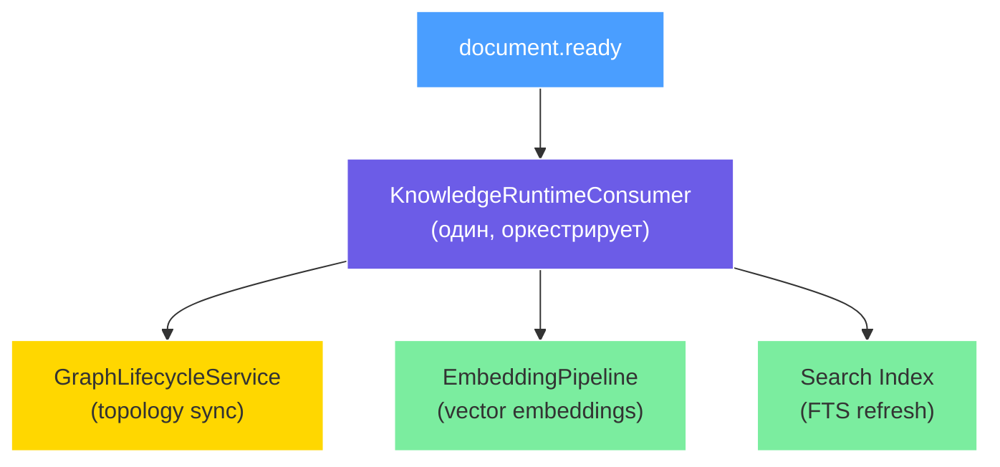
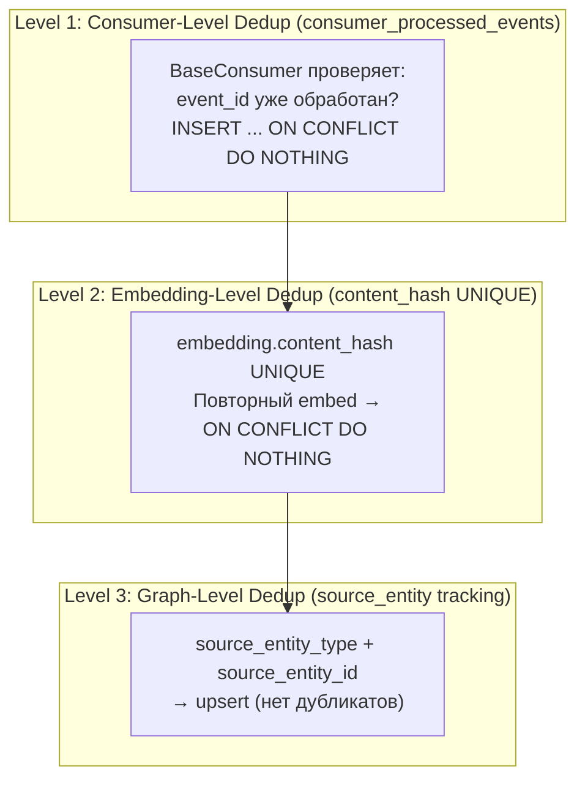
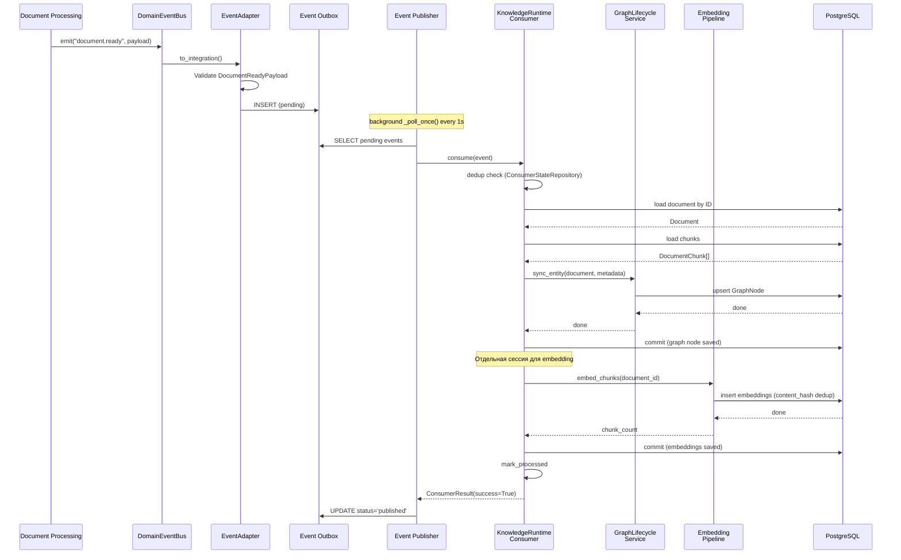
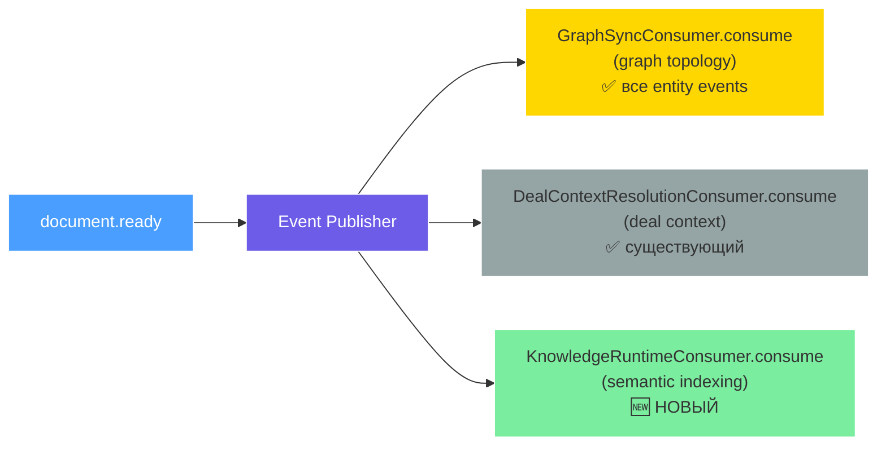
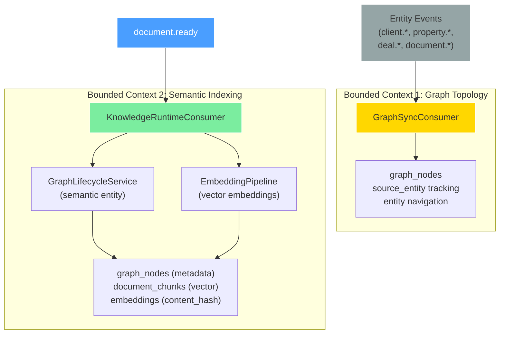
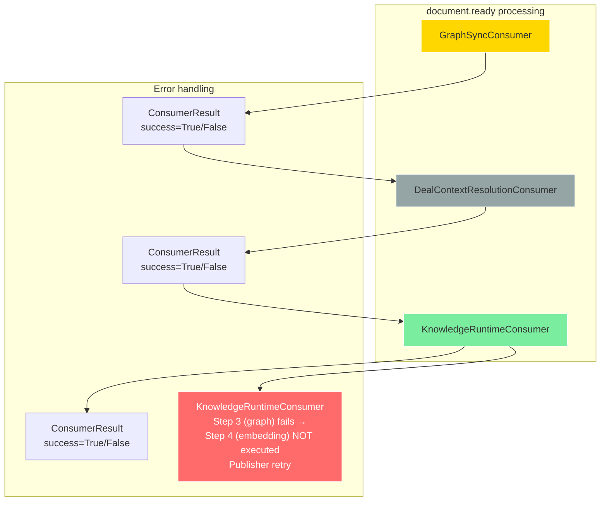

# Knowledge Runtime Integration — Phase 1 Design Proposal

> **Date:** 2026-07-26  
> **Status:** Draft (Phase 1 Proposal — Revised)  
> **Context:** Phase 0 Discovery завершён → Architecture Review **APPROVED с 7 ADR** → Уточнение: **5 ADR, 1 KnowledgeRuntimeConsumer**  
> **Phase 0 Document:** `docs/epics/epic3/knowledge-runtime-integration/current-knowledge-runtime.md`  
> **Author:** Architecture — RealtorOS

---

## Table of Contents

1. [Motivation](#1-motivation)
2. [Architecture Decisions (5 ADR)](#2-architecture-decisions-5-adr)
3. [Component Design](#3-component-design)
4. [Data Flow](#4-data-flow)
5. [Schema Changes](#5-schema-changes)
6. [Scope Guard](#6-scope-guard)
7. [Delivery Guarantees](#7-delivery-guarantees)
8. [Definition of Done](#8-definition-of-done)
9. [Implementation Plan](#9-implementation-plan)
10. [Exit Criteria](#10-exit-criteria)
11. [Decision Log](#11-decision-log)

---

## 1. Motivation

### 1.1 Problem Statement

Knowledge Runtime в RealtorOS находится в **нерабочем состоянии**, несмотря на полностью построенную инфраструктуру:

| Компонент | Статус | Последствия |
|-----------|--------|-------------|
| **GraphSyncConsumer** | ❌ Баг — `GraphLifecycleService()` создаётся без `session` | `sync_entity()` падает с `AttributeError`. Весь Event Backbone не синхронизирует CRM-сущности с графом. |
| **EmbeddingPipeline** | ❌ Отключён — `embed_chunks()` никем не вызывается | Векторные поиски возвращают пустые или неполные результаты. Hybrid search (BM25 + vector) не эффективен. |
| **Search Index** | ❌ Stub — `search_index_handler` — пустой логгер | После загрузки документа индекс не обновляется. Пользователь видит устаревшие результаты. |
| **DocumentReady Payload** | ❌ Нет формальной схемы | DealContextResolutionConsumer парсит `payload.document_id` и `payload.profile` без валидации. Ошибки формата не отлавливаются. |

Phase 1 исправляет эти **4 критические проблемы**, делая Knowledge Runtime работоспособным end-to-end: от `document.ready` до graph sync + embedding + search index update.

### 1.2 Why One Consumer (Not Three Separate)

Три отдельных consumer'а (GraphSync, Embedding, SearchIndex) — **избыточная сложность** для Phase 1:

1. **Общая зависимость:** Все три consumer'а зависят от `document.ready` и работают с одним документом. Разделение не даёт реальной error isolation — если embedding падает, search index бессмысленен.
2. **Оркестрация:** Embedding должен завершиться до обновления search index. Три отдельных consumer'а требуют согласования порядка через Publisher, что усложняет дебаггинг.
3. **Publisher overhead:** Каждый consumer проходит dedup, retry, outlog через ConsumerStateRepository — тройной overhead для одной логической операции.

**Решение:** Один `KnowledgeRuntimeConsumer`, который оркестрирует Graph + Embedding + Search внутри себя. Это **не god consumer** — внутренние вызовы разделены на сервисы (GraphLifecycleService, EmbeddingPipeline), каждый со своей транзакцией.



### 1.3 GraphSyncConsumer — Отдельный Bounded Context

Важное уточнение: **GraphSyncConsumer НЕ расширяется и НЕ поглощается.** Он живёт своей жизнью:

```
GraphSyncConsumer:
  ── consumer_name = "graph_sync"
  ── Назначение: синхронизация CRM-сущностей с Knowledge Graph (topology/navigation)
  ── События: все entity events (client.*, property.*, deal.*, document.*)
  ── Проблема: баг с session — ИСПРАВЛЯЕТСЯ отдельно

KnowledgeRuntimeConsumer:
  ── consumer_name = "knowledge_runtime"
  ── Назначение: semantic indexing (graph node + embeddings + search)
  ── Событие: только document.ready
  ── Новый consumer
```

**Graph = topology, Knowledge = semantic indexing.** Разные bounded contexts. GraphSyncConsumer остаётся для graph topology/navigation. KnowledgeRuntimeConsumer — semantic indexing.

### 1.4 Why Event-Driven (Not API-Triggered)

Embedding должен запускаться **автоматически** при `document.ready`, без ручного вызова. Event Backbone — единственный source of truth для runtime-синхронизации. API-driven embedding был бы race-condition prone и требовал бы координации с Event Backbone.

---

## 2. Architecture Decisions (5 ADR)

### ADR-001: KnowledgeRuntimeConsumer (Один, Не 3 Отдельных)

**Context:** Phase 0 design предполагал три отдельных consumer'а на `document.ready`: GraphSyncConsumer (fix), EmbeddingConsumer (new), SearchIndexConsumer (new). Анализ показал, что это избыточная сложность:

- Все три consumer'а работают **с одним и тем же документом**
- EmbeddingConsumer и SearchIndexConsumer **логически последовательны** (search не имеет смысла без embedding)
- Три ConsumerStateRepository записи для одной операции
- Publisher sequencing (GraphSync → Embedding → Search) дублирует логику, которая может быть внутри одного consumer'а

**Decision:** Один `KnowledgeRuntimeConsumer`, который оркестрирует:

```
document.ready → KnowledgeRuntimeConsumer
                     ↓
            ┌───────┼───────┐
            ↓       ↓       ↓
     GraphLifecycle  Embedding  Search
     Service         Pipeline   Index
```

**Key constraint:** `KnowledgeRuntimeConsumer` **НЕ расширяет** `GraphSyncConsumer`. `GraphSyncConsumer` остаётся отдельным consumer'ом для graph topology. `KnowledgeRuntimeConsumer` — semantic indexing.

```python
class KnowledgeRuntimeConsumer(BaseConsumer):
    """Оркестрирует semantic indexing: graph node + embeddings + search.

    Не заменяет GraphSyncConsumer. GraphSyncConsumer = graph topology (entity events).
    KnowledgeRuntimeConsumer = semantic indexing (document.ready). Разные bounded contexts.
    """

    consumer_name = "knowledge_runtime"

    def __init__(
        self,
        dsn: str,
        session_factory: async_sessionmaker,
        embedding_pipeline: EmbeddingPipeline,
    ) -> None:
        super().__init__(consumer_name=self.consumer_name, dsn=dsn)
        self._session_factory = session_factory
        self._embedding_pipeline = embedding_pipeline

    async def _process(self, event: IntegrationEvent) -> None:
        payload = DocumentReadyPayload(**event.payload)

        async with self._session_factory() as session:
            # Step 1: Load document
            doc = await self._load_document(session, payload.document_id)
            if not doc:
                logger.warning(
                    "document_not_found",
                    event_id=str(event.event_id),
                    document_id=str(payload.document_id),
                )
                return

            # Step 2: Ensure chunks exist
            chunks = await self._ensure_chunks(session, doc)

            # Step 3: Sync graph node (semantic entity)
            await self._sync_graph_node(
                session=session,
                document=doc,
                payload=payload,
            )
            await session.commit()

        # Step 4: Embed chunks (может быть долгим — отдельная сессия)
        async with self._session_factory() as session:
            try:
                count = await self._embedding_pipeline.embed_chunks(payload.document_id)
                await session.commit()

                logger.info(
                    "knowledge_runtime_embedding_completed",
                    event_id=str(event.event_id),
                    document_id=str(payload.document_id),
                    chunks_count=count,
                )
            except Exception:
                await session.rollback()
                logger.exception(
                    "knowledge_runtime_embedding_failed",
                    event_id=str(event.event_id),
                    document_id=str(payload.document_id),
                )
                raise

        # Step 5: Verify search index (логика FTS refresh)
        logger.info(
            "knowledge_runtime_completed",
            event_id=str(event.event_id),
            document_id=str(payload.document_id),
        )
```

**Consequences:**
+ Одна точка оркестрации, меньше кода, меньше ConsumerStateRepository записей
+ Embedding и Search логически связаны — не нужно согласование через Publisher
- Если graph sync падает → embedding не запускается (trade-off: accept для Phase 1)
- Нельзя независимо деплоить embedding и graph sync (trade-off: accept — оба в одном репозитории)

**Status:** Proposed

---

### ADR-002: DocumentReady as Source of Truth

**Context:** Knowledge Runtime нужно синхронизировать semantic indexing при готовности документа. Какой event использовать как триггер?

**Options:**
- `DealContextResolved` (приходит позже, как enrichment — не гарантирован)
- `document.ready` (первичный event, содержит full ContractProfile JSONB)

**Decision:** `document.ready` — **единственный root event** для KnowledgeRuntimeConsumer. Consumer получает **IntegrationEvent**, не DomainEvent напрямую.

**Key principle:** Consumer сам загружает document, chunks, metadata из БД. Не таскать весь документ через событие.

**Payload contract (минимальный):**
```python
@dataclass(frozen=True)
class DocumentReadyPayload:
    document_id: UUID
    profile: dict
    source: str = "document.ready"
```

**Consequences:**
+ Делает payload лёгким (только идентификатор)
+ Consumer сам решает, какие данные ему нужны (загружает из БД)
+ Schema evolution проще — payload не меняется при изменении Document модели
- Дополнительный SELECT в БД (negligible overhead)

**Status:** Proposed

---

### ADR-003: Embedding Ownership — Отдельный Сервис, Consumer Оркестрирует

**Context:** EmbeddingPipeline.embed_chunks() существует, но никем не вызывается. Как consumer должен взаимодействовать с pipeline?

**Options:**
1. Consumer вызывает embedder напрямую (tight coupling)
2. Consumer вызывает EmbeddingPipeline как сервис (loose coupling)
3. Embedding запускается через отдельный API/cron (rejected — ADR-002)

**Decision:** Consumer оркестрирует, НЕ вызывает embedder напрямую.

```python
# ✅ Consumer оркестрирует через EmbeddingPipeline (сервис)
await self._embedding_pipeline.embed_chunks(document_id)

# ❌ Consumer НЕ вызывает embedder напрямую
# from some_ai_library import embed
# embeddings = embed(chunks)  # НЕТ
```

**Rationale:**
- `EmbeddingPipeline` — готовый сервис с session management
- Pipeline управляет content_hash dedup, batch processing, retry
- Consumer отвечает только за orchestration, не за implementation

**Consequences:**
+ EmbeddingPipeline можно тестировать независимо
+ Pipeline может быть заменён (sentence-transformers → API) без изменения consumer'а
+ Consumer остаётся тонким оркестратором

**Status:** Proposed

---

### ADR-004: Idempotency

**Context:** Event Backbone гарантирует at-least-once delivery. Consumer должен быть идемпотентным, чтобы повторная обработка того же event не создавала дубликатов.

**Decision:** Три уровня идемпотентности:



**Level 1 — Consumer-level:** `consumer_processed_events` таблица (BaseConsumer):
```sql
INSERT INTO consumer_processed_events (consumer_name, event_id, processed_at)
VALUES ('knowledge_runtime', $1, NOW())
ON CONFLICT DO NOTHING;
```

**Level 2 — Content hash UNIQUE:** На `embedding` таблице уже есть `content_hash UNIQUE` constraint. Повторный вызов `embed_chunks()` для тех же chunks — `ON CONFLICT DO NOTHING`.

**Level 3 — Source entity tracking:** `GraphNode` создаётся через `sync_entity()` с `source_entity_type` + `source_entity_id`. Upsert — нет дубликатов graph nodes.

**Consequences:**
+ Effectively-once processing даже при at-least-once delivery
+ Replay безопасен — очистил consumer_processed_events → replay без дубликатов
+ EmbeddingPipeline.content_hash — дополнительный safety net

**Status:** Proposed

---

### ADR-005: DocumentReadyPayload Contract

**Context:** DealContextResolutionConsumer парсит `payload.document_id` и `payload.profile` без валидации. Нет контракта, какие поля обязательны.

**Decision:** Зафиксировать `DocumentReadyPayload` dataclass с минимальным контрактом.

```python
from dataclasses import dataclass, field
from uuid import UUID


@dataclass(frozen=True)
class DocumentReadyPayload:
    """Формальный контракт payload для document.ready event.

    Минимальный — только идентификатор документа.
    Все остальные данные consumer загружает из БД самостоятельно.
    """

    document_id: UUID
    profile: dict = field(default_factory=dict)
    source: str = "document.ready"
```

**Валидация** происходит при конструировании `IntegrationEvent` в `EventAdapter.to_integration()`:

```python
# В EventAdapter.to_integration():
try:
    validated = DocumentReadyPayload(
        document_id=UUID(domain_event.payload.get("document_id")),
        profile=domain_event.payload.get("profile", {}),
    )
except (ValueError, TypeError, KeyError) as e:
    raise InvalidPayloadError(f"Invalid document.ready payload: {e}") from e

integration_event.payload = {
    "document_id": str(validated.document_id),
    "profile": validated.profile,
    "source": validated.source,
}
```

**Consequences:**
+ Все consumer'ы получают гарантированно валидный payload
+ Ошибка валидации → `ConsumerResult(success=False, retryable=False)` (poison message → dead letter)
+ Минимальный payload — лёгкий для передачи через Event Backbone

**Status:** Proposed

---

## 3. Component Design

### 3.1 KnowledgeRuntimeConsumer

**Новый consumer.** Наследует `BaseConsumer`. Consumer **НЕ содержит** SQL, embedding generation, graph mutation — делегирует всё `KnowledgeRuntimeService`.

Правильная архитектура:

```
KnowledgeRuntimeConsumer
    |
    v
KnowledgeRuntimeService
    |
    +-- GraphLifecycleService
    |
    +-- DocumentRepository / ChunkRepository
    |
    +-- EmbeddingPipeline
    |
    +-- SearchIndexUpdater
```

Consumer выглядит так:

```python
from __future__ import annotations

from structlog import get_logger

from backend.core.integration_event import IntegrationEvent
from backend.infrastructure.consumer_base import BaseConsumer
from backend.services.knowledge_runtime.models import DocumentReadyPayload
from backend.services.knowledge_runtime.service import KnowledgeRuntimeService

logger = get_logger(__name__)


class KnowledgeRuntimeConsumer(BaseConsumer):
    """Consumes document.ready → delegates to KnowledgeRuntimeService.

    Consumer is a thin orchestrator. It does NOT contain:
      - SQL queries (load document, chunks)
      - Embedding generation
      - Graph mutations

    Everything is delegated to KnowledgeRuntimeService.
    """

    consumer_name = "knowledge_runtime"

    def __init__(self, dsn: str, session_factory) -> None:
        super().__init__(consumer_name=self.consumer_name, dsn=dsn)
        self._service = KnowledgeRuntimeService(session_factory)

    async def _process(self, event: IntegrationEvent) -> None:
        payload = DocumentReadyPayload(**event.payload)
        await self._service.process(payload)
```

**Chunk extraction assumption:** Phase 0 Discovery отметила, что chunk extraction (разбиение документа на chunks) не обнаружен в коде. Phase 1 **предполагает**, что `DocumentChunk` записи уже существуют к моменту `document.ready` — они создаются на этапе Processing (до `document.ready`). Если это не так — это отдельный баг, который блокирует Phase 1 и требует отдельного ADR.

**Регистрация в main.py:**

```python
# ── KnowledgeRuntimeConsumer (NEW) ──
from backend.infrastructure.consumers.knowledge_runtime_consumer import (
    KnowledgeRuntimeConsumer,
)

knowledge_runtime = KnowledgeRuntimeConsumer(
    dsn=settings.DATABASE_SYNC_URL,
    session_factory=async_session_factory,
)

publisher.register_consumer("document.ready", knowledge_runtime.consume)
```

### 3.2 KnowledgeRuntimeService

**Новый сервис.** Оркестрирует полный pipeline semantic indexing. Consumer делегирует всё сервису — сервис управляет session, загружает данные, вызывает GraphLifecycleService, EmbeddingPipeline, SearchIndexUpdater.

```python
"""KnowledgeRuntimeService — orchestrates semantic indexing pipeline.

Delegates to:
  - GraphLifecycleService — create/update GraphNode
  - DocumentRepository / ChunkRepository — load document and chunks
  - EmbeddingPipeline — generate vector embeddings
  - SearchIndexUpdater — refresh FTS search index

Design decisions:
  - Two transaction boundaries: graph sync (commit) → embedding (commit)
  - Service, not repository: orchestrates, does not manage data directly
  - Consumer is only delegation: no SQL, no embedding, no graph mutation
"""

from __future__ import annotations

from uuid import UUID

from sqlalchemy import select
from sqlalchemy.ext.asyncio import AsyncSession, async_sessionmaker
from structlog import get_logger

from backend.ai.embeddings import EmbeddingPipeline
from backend.infrastructure.consumer_base import ConsumerResult
from backend.models.document import Document
from backend.models.document_chunk import DocumentChunk
from backend.services.graph_lifecycle_service import GraphLifecycleService
from backend.services.knowledge_runtime.models import DocumentReadyPayload

logger = get_logger(__name__)


class KnowledgeRuntimeService:
    """Orchestrates semantic indexing: graph node + embeddings + search index."""

    def __init__(self, session_factory: async_sessionmaker) -> None:
        self._session_factory = session_factory
        self._embedding_pipeline = EmbeddingPipeline(
            session_factory=session_factory,
        )

    async def process(self, payload: DocumentReadyPayload) -> None:
        document_id = payload.document_id

        # Step 1-3: Load document, chunks, sync graph (own transaction)
        async with self._session_factory() as session:
            doc = await self._load_document(session, document_id)
            if doc is None:
                logger.warning(
                    "knowledge_runtime_document_not_found",
                    document_id=str(document_id),
                )
                return

            await self._ensure_chunks(session, doc)
            await self._sync_graph_node(session, doc, payload)
            await session.commit()

        # Step 4: Embed chunks (separate session — may be long-running)
        async with self._session_factory() as session:
            try:
                count = await self._embedding_pipeline.embed_chunks(document_id)
                await session.commit()
                logger.info(
                    "knowledge_runtime_embedding_completed",
                    document_id=str(document_id),
                    chunks_count=count,
                )
            except Exception:
                await session.rollback()
                raise

        # Step 5: Search index (verify/log)
        logger.info(
            "knowledge_runtime_completed",
            document_id=str(document_id),
        )

    async def _load_document(
        self,
        session: AsyncSession,
        document_id: UUID,
    ) -> Document | None:
        result = await session.execute(
            select(Document).where(Document.id == document_id)
        )
        return result.scalar_one_or_none()

    async def _ensure_chunks(
        self,
        session: AsyncSession,
        doc: Document,
    ) -> list[DocumentChunk]:
        result = await session.execute(
            select(DocumentChunk).where(DocumentChunk.document_id == doc.id)
        )
        chunks = list(result.scalars().all())
        if not chunks:
            logger.warning(
                "knowledge_runtime_no_chunks",
                document_id=str(doc.id),
            )
        return chunks

    async def _sync_graph_node(
        self,
        session: AsyncSession,
        doc: Document,
        payload: DocumentReadyPayload,
    ) -> None:
        svc = GraphLifecycleService(session=session)
        await svc.sync_entity(
            entity_type="document",
            entity_id=doc.id,
            title=getattr(doc, "title", "document"),
            metadata={
                "document_id": str(doc.id),
                "profile": payload.profile,
                "source": "knowledge_runtime",
            },
        )
```

**Design decisions:**
- Две transaction boundaries: graph sync → commit, затем embedding → commit
- Сервис — не repository: он оркестрирует, а не управляет данными напрямую
- Consumer — только delegation: ни SQL, ни embedding, ни graph mutation
- `EmbeddingPipeline` создаётся внутри сервиса (не передаётся из consumer'а)

### 3.3 DocumentReadyPayload Dataclass

```python
"""DocumentReadyPayload — formal schema for document.ready event payload.

Валидируется при создании IntegrationEvent в EventAdapter.to_integration().
Consumer использует dataclass для type-safe доступа к payload.
"""

from __future__ import annotations

from dataclasses import dataclass, field
from uuid import UUID


@dataclass(frozen=True)
class DocumentReadyPayload:
    """Formal contract for document.ready event payload.

    Attributes:
        document_id: UUID документа (обязательный).
        profile: ContractProfile JSONB (опциональный, может быть пустым).
        source: Источник события — всегда "document.ready".
    """

    document_id: UUID
    profile: dict = field(default_factory=dict)
    source: str = "document.ready"
```

### 3.4 GraphSyncConsumer Fix

**Текущее состояние (BUG):**

```python
# graph_sync_consumer.py — строка 52
svc = GraphLifecycleService()  # ❌ NO session passed!
# Внутри sync_entity() вызывает self.session.execute() → AttributeError
```

**Исправление:** Передать async SQLAlchemy session в GraphLifecycleService.

```python
class GraphSyncConsumer(BaseConsumer):
    """Синхронизация CRM-сущностей с Knowledge Graph (topology/navigation).

    Не зависит от KnowledgeRuntimeConsumer. Отдельный bounded context.
    Обрабатывает все entity events (client.*, property.*, deal.*, document.*).
    """

    consumer_name = "graph_sync"

    def __init__(self, dsn: str, session_factory: async_sessionmaker):
        super().__init__(consumer_name=self.consumer_name, dsn=dsn)
        self._session_factory = session_factory

    async def _process(self, event: IntegrationEvent) -> None:
        from backend.services.graph_lifecycle_service import GraphLifecycleService

        entity_type = event.aggregate_type
        entity_id = event.aggregate_id
        source_label = event.event_type.split(".")[0]

        try:
            entity_id_uuid = UUID(str(entity_id))
        except (ValueError, AttributeError):
            entity_id_uuid = entity_id

        async with self._session_factory() as session:
            svc = GraphLifecycleService(session=session)  # ✅ session passed
            await svc.sync_entity(
                entity_type=entity_type,
                entity_id=entity_id_uuid,
                title=source_label,
                metadata=event.payload,  # ✅ Payload передаётся как metadata
            )
            await session.commit()

        logger.info(
            "graph_sync_consumer_completed",
            event_id=str(event.event_id),
            event_type=event.event_type,
            aggregate_id=event.aggregate_id,
        )
```

**Изменения:**
1. `__init__` принимает `session_factory: async_sessionmaker`
2. `_process` создаёт async session через `async with self._session_factory()`
3. `GraphLifecycleService(session=session)` — session передаётся
4. `svc.sync_entity(metadata=event.payload)` — payload передаётся как metadata (gap-fix)
5. `await session.commit()` — транзакция коммитится
6. Consumer не удаляется и не расширяется — остаётся для graph topology

---

## 4. Data Flow

### 4.1 End-to-End Flow (document.ready → KnowledgeRuntimeConsumer)



### 4.2 Consumer Registration (GraphSync + KnowledgeRuntime + DealContextResolution)



**Порядок consumer'ов на `document.ready`:**

| # | Consumer | Тип | Назначение |
|---|----------|-----|------------|
| 1 | `GraphSyncConsumer` | Существующий (fix) | Синхронизация CRM-сущности с Knowledge Graph (topology) |
| 2 | `DealContextResolutionConsumer` | Существующий | Разрешение контекста сделки (Property, Clients) |
| 3 | `KnowledgeRuntimeConsumer` | **Новый** | Semantic indexing: graph node + embeddings + search |

### 4.3 Relationship: GraphSyncConsumer vs KnowledgeRuntimeConsumer



### 4.4 Error Isolation



**Ключевой момент:** Publisher вызывает consumer'ов последовательно. Ошибка в GraphSyncConsumer блокирует все последующие consumer'ы для **этого конкретного event**. Другие events в том же batch не блокируются.

Внутри KnowledgeRuntimeConsumer: если graph sync падает (Step 3) → embedding (Step 4) **не выполняется**. Весь consumer возвращает `ConsumerResult(success=False, retryable=True)`, Publisher retry'ит.

---

## 5. Schema Changes

### 5.1 File: `backend/services/knowledge_runtime/models.py` (NEW)

Создаётся новый файл для Knowledge Runtime моделей и схем.

```python
"""Knowledge Runtime data models and schemas.

Phase 1:
  - DocumentReadyPayload — formal schema for document.ready event payload
"""

from __future__ import annotations

from dataclasses import dataclass, field
from uuid import UUID


@dataclass(frozen=True)
class DocumentReadyPayload:
    """Formal contract for document.ready event payload.

    Validated at event creation time in EventAdapter.to_integration().
    Consumer loads document data from DB — payload stays minimal.

    Attributes:
        document_id: UUID документа (обязательный).
        profile: ContractProfile JSONB (опциональный, может быть пустым).
        source: Источник события — всегда "document.ready".
    """

    document_id: UUID
    profile: dict = field(default_factory=dict)
    source: str = "document.ready"
```

### 5.2 Modified Files

| File | Change | Type |
|------|--------|------|
| `backend/infrastructure/consumers/knowledge_runtime_consumer.py` | **NEW** — KnowledgeRuntimeConsumer class | New |
| `backend/infrastructure/consumers/graph_sync_consumer.py` | Передать session, передавать payload как metadata | Fix |
| `backend/services/knowledge_runtime/models.py` | **NEW** — DocumentReadyPayload dataclass | New |
| `backend/main.py` | Зарегистрировать KnowledgeRuntimeConsumer + исправить GraphSyncConsumer | Change |
| `backend/core/domain_events.py` или `backend/core/integration_event.py` | Включить валидацию DocumentReadyPayload | Change |

### 5.3 No Database Migrations Required (Phase 1)

| Изменение | Статус | Причина |
|-----------|--------|---------|
| New tables | ❌ НЕТ | Все таблицы существуют |
| New columns | ❌ НЕТ | Существующие поля достаточны |
| New indexes | ❌ НЕТ | Существующие HNSW/IVFFlat покрывают |
| FTS trigger | ❌ НЕТ | Phase 1 — проверка, не создание |
| ConsumerStateRepository | ❌ НЕТ | Работает с существующей таблицей |

---

## 6. Scope Guard

### 6.1 In Scope (Phase 1)

| # | Компонент | Изменение | ADR |
|---|-----------|-----------|-----|
| 1 | **KnowledgeRuntimeConsumer (NEW)** | Новый consumer на document.ready — оркестрирует graph + embedding + search | ADR-001 |
| 2 | **GraphSyncConsumer Fix** | Передать async SQLAlchemy session + payload как metadata | ADR-002 |
| 3 | **EmbeddingPipeline Integration** | KnowledgeRuntimeConsumer вызывает EmbeddingPipeline.embed_chunks() | ADR-003 |
| 4 | **DocumentReadyPayload schema** | Dataclass + валидация в EventAdapter | ADR-005 |
| 5 | **Consumer registration** | KnowledgeRuntimeConsumer + GraphSyncConsumer fix в main.py | ADR-001, ADR-002 |

### 6.2 Explicitly Out of Scope

| # | Компонент | Почему |
|---|-----------|--------|
| ❌ | **Unified Search rewrite** | Оставляем существующий hybrid search (POST /api/v1/knowledge/search) |
| ❌ | **KnowledgeRuntimeIntegrator** | Accounting Binding слой — отдельный Phase |
| ❌ | **ConsumerStateRepository async rewrite** | sync psycopg2 — known issue, Phase 2 |
| ❌ | **BusinessEvents archive** | Не блокирует Phase 1 |
| ❌ | **KnowledgeGraphBuilder migration** | Offline batch rebuild — не в runtime scope |
| ❌ | **New Vector DB / PGVector migration** | Существующий pgvector (384 dim) достаточен |
| ❌ | **RAG / LLM agents** | Phase 1 — только индексация |
| ❌ | **Knowledge UI** | Frontend — отдельный Phase |
| ❌ | **KnowledgeRevision / Projection** | Integrator excluded |
| ❌ | **Dead code cleanup** (knowledge_search.py, knowledge_traversal.py) | Not a blocker — Phase 2 |
| ❌ | **`test_freshness.py` fix** | Падающий тест с dead imports — Phase 2 |

### 6.3 Known Gaps Not Addressed (Phase 1)

| Gap | Impact | When |
|-----|--------|------|
| `DocumentChunk` creation before `document.ready` — не обнаружен код | Если chunks не созданы — Embedding вернёт 0 | Must be verified before Phase 1 close |
| `GraphNode.__table_args__` missing `UniqueConstraint` | Не влияет на runtime (constraint в миграции) | Phase 2 |
| sync psycopg2 в ConsumerStateRepository | Event loop blocking | Phase 2 |
| `test_freshness.py` imports dead `graph_sync_handler` | Падающий тест | Phase 2 |

---

## 7. Delivery Guarantees

### 7.1 Consumer Ordering

Publisher вызывает consumer'ов **последовательно** для каждого event:

1. `GraphSyncConsumer`
2. `DealContextResolutionConsumer`
3. `KnowledgeRuntimeConsumer`

**Если GraphSyncConsumer падает** — KnowledgeRuntimeConsumer **не вызывается** для этого event. Event остаётся в статусе `failed`, Publisher retry'ит с backoff (1s, 2s, 4s). После max_retries (3) → dead letter.

### 7.2 Error Isolation by Event

Каждый event обрабатывается независимо. Ошибка при обработке `document.ready` для документа A:
- **НЕ блокирует** обработку `document.ready` для документа B
- **НЕ блокирует** обработку `client.created` (другой тип)
- **НЕ блокирует** Publisher (`_poll_once()` продолжает выбирать новые events)

### 7.3 Transaction Boundaries

| Consumer | Session | Commit point | Isolation |
|----------|---------|--------------|-----------|
| GraphSyncConsumer | `async with self._session_factory() as session` | `await session.commit()` | Independent |
| KnowledgeRuntimeConsumer (graph) | `async with self._session_factory() as session` | `await session.commit()` | Independent |
| KnowledgeRuntimeConsumer (embedding) | `async with self._session_factory() as session` | `await session.commit()` | Independent |

**Каждая операция — своя транзакция.** Если graph sync commit'ится, а embedding падает — graph node сохранён, embedding не создан. Это **приемлемо** для Phase 1 (embedding будет перезапущен при retry event'а).

### 7.4 Effectively-Once Delivery

```
ConsumerStateRepository (table: consumer_processed_events)
  → consumer_name: str (PK)
  → event_id: UUID (PK)
  → processed_at: timestamptz
  → INSERT ... ON CONFLICT DO NOTHING
```

**Механизм:**
1. Consumer проверяет: `SELECT 1 FROM consumer_processed_events WHERE consumer_name=? AND event_id=?`
2. Если found → skip (`ConsumerResult(success=True)`)
3. Если not found → process → INSERT ON CONFLICT

**Гарантии:**
- **Effectively-once processing** (consumer-level dedup)
- **At-least-once** на уровне Outbox → Publisher (retry mechanism)
- **Idempotent business logic** — `sync_entity()` upsert, `embed_chunks()` dedup by content_hash

### 7.5 Replay Support

ConsumerStateRepository позволяет replay: очистить `consumer_processed_events` для KnowledgeRuntimeConsumer → Publisher переобработает все failed/pending events.

**Не поддерживается в Phase 1:**
- Полный replay через BusinessEvents append log
- Selective replay конкретного event по event_id

### 7.6 Partial Failure

**Сценарий:** Graph sync ✅, Embedding ❌

Consumer возвращает:

```python
ConsumerResult(success=False, retryable=True)
```

**Гарантии:**
- Система **НЕ** остаётся в "полуготовом" состоянии
- При retry: idempotency гарантирует что успешные операции (GraphNode создан) не дублируются
- `content_hash UNIQUE` предотвращает duplicate embeddings при retry
- `consumer_processed_events` — финальная точка; если `mark_processed` не был вызван, retry безопасен

---

## 8. Definition of Done

### 8.1 Functional

| # | Criterion | Verification |
|---|-----------|-------------|
| ✅ | DocumentReady event создаёт Knowledge Graph entry | GraphNode запись в БД с source_entity_type="document" |
| ✅ | Document chunks загружены и готовы к embedding | DocumentChunk записи существуют |
| ✅ | Document chunks заэмбедчены | Embedding записи в БД для каждого chunk |
| ✅ | Vector search возвращает документ | POST /api/v1/knowledge/search возвращает результат |
| ✅ | Replay безопасен | Повторная обработка того же event не создаёт дубликатов |

### 8.2 Non-functional

| # | Criterion | Verification |
|---|-----------|-------------|
| ✅ | Consumer идемпотентен | Дважды тот же event → второй skip без изменений |
| ✅ | Retry безопасен | ConsumerStateRepository дублирует event_id; повторный process запрещён |
| ✅ | Нет duplicate embeddings | content_hash UNIQUE constraint |
| ✅ | Нет duplicate graph nodes | sync_entity() — upsert семантика |

### 8.3 Code Changes

| # | Task | Acceptance Criteria |
|---|------|--------------------|
| 1 | `KnowledgeRuntimeConsumer` | 1. Новый файл `consumers/knowledge_runtime_consumer.py` <br>2. Наследует `BaseConsumer` <br>3. Загружает document из БД <br>4. Загружает chunks <br>5. Вызывает `GraphLifecycleService.sync_entity()` <br>6. Вызывает `EmbeddingPipeline.embed_chunks()` <br>7. Две session: graph + embedding |
| 2 | `GraphSyncConsumer` fix | 1. `__init__` принимает `session_factory` <br>2. `_process` создаёт async session <br>3. `GraphLifecycleService` получает session <br>4. `event.payload` передаётся как `metadata` <br>5. `await session.commit()` присутствует |
| 3 | `DocumentReadyPayload` | 1. Файл `services/knowledge_runtime/models.py` <br>2. Dataclass с `document_id: UUID` <br>3. Интеграция с EventAdapter |
| 4 | `main.py` registration | 1. GraphSyncConsumer получает `session_factory` <br>2. KnowledgeRuntimeConsumer зарегистрирован на `document.ready` |

### 8.4 Tests

| # | Test | Type | Criteria |
|---|------|------|----------|
| 1 | KnowledgeRuntimeConsumer unit test | Unit | `_process` загружает document, вызывает sync_entity и embed_chunks |
| 2 | KnowledgeRuntimeConsumer integration test | Integration | document.ready → GraphNode + Embedding записи в БД |
| 3 | GraphSyncConsumer unit test | Unit | `_process` создаёт session, вызывает `sync_entity` с payload |
| 4 | GraphSyncConsumer integration test | Integration | document.ready → GraphNode создаётся в БД |
| 5 | DocumentReadyPayload validation test | Unit | Valid payload → OK, missing document_id → ValueError |
| 6 | Idempotency test | Integration | Дважды тот же event → второй skip без изменений |

### 8.5 Documentation

| # | Document | Status |
|---|----------|--------|
| 1 | Phase 1 Design Proposal (этот документ) | ✅ |
| 2 | `current-knowledge-runtime.md` update | После утверждения proposal |
| 3 | README update (Knowledge Runtime section) | После реализации |

### 8.6 Replay E2E

**Сценарий:** `document.ready` → KnowledgeRuntimeConsumer → crash → retry → same event

**Проверка:**
- ❌ Нет второго GraphNode (`source_entity_type` + `source_entity_id` unique)
- ❌ Нет второго Embedding (`content_hash` UNIQUE)
- ✅ Search возвращает один результат
- ✅ `consumer_processed_events` содержит ровно одну запись

---

## 9. Implementation Plan

### Phase 1 — Foundation (Consumer + Service)

| Step | Duration | Deliverable |
|------|----------|-------------|
| 1.1 | 1 day | `backend/services/knowledge_runtime/models.py` — DocumentReadyPayload dataclass |
| 1.2 | 2 days | `backend/infrastructure/consumers/knowledge_runtime_consumer.py` — KnowledgeRuntimeConsumer |
| 1.3 | 1 day | `backend/main.py` — регистрация KnowledgeRuntimeConsumer на document.ready |
| 1.4 | 2 days | Unit + integration tests |

**Total:** ~6 days

### Phase 2 — Graph Fix (Session Bug)

| Step | Duration | Deliverable |
|------|----------|-------------|
| 2.1 | 1 day | GraphSyncConsumer — добавить session_factory в `__init__` |
| 2.2 | 1 day | GraphSyncConsumer — передавать session в GraphLifecycleService |
| 2.3 | 1 day | Tests: unit + integration |

**Total:** ~3 days

### Phase 3 — Embedding Integration

| Step | Duration | Deliverable |
|------|----------|-------------|
| 3.1 | 2 days | Wire EmbeddingPipeline через KnowledgeRuntimeConsumer |
| 3.2 | 2 days | Integration test: document.ready → embeddings in DB |

**Total:** ~4 days

### Phase 4 — Search Verification

| Step | Duration | Deliverable |
|------|----------|-------------|
| 4.1 | 1 day | Verify POST /api/v1/knowledge/search returns results after embedding |
| 4.2 | 1 day | End-to-end smoke test |

**Total:** ~2 days

**Overall:** ~15 days

---

## 10. Exit Criteria

Phase 1 считается завершённым, когда:

### 10.1 Functional Criteria

1. [ ] **KnowledgeRuntimeConsumer работает** — после `document.ready`, consumer загружает document, создаёт GraphNode, генерирует embeddings.
2. [ ] **GraphSyncConsumer функционирует** — после entity event, GraphNode создаётся с корректным `source_entity_type`, `source_entity_id`, `metadata`.
3. [ ] **DocumentReadyPayload валидируется** — при создании IntegrationEvent с невалидным payload — ошибка, event в dead letter.
4. [ ] **Vector search возвращает результаты** — после embedding, `POST /api/v1/knowledge/search` возвращает документ.

### 10.2 Non-Functional Criteria

5. [ ] **Idempotency** — повторная обработка того же event не создаёт дубликатов GraphNode или Embedding записей.
6. [ ] **Dead letter** — event, который упал max_retries раз, переходит в статус 'dead' в outbox.
7. [ ] **Startup** — приложение стартует без ошибок, если Publisher не может быть запущен (graceful degradation).

### 10.3 Test Criteria

8. [ ] **Все unit tests проходят** — минимум 6 тестов (см. Definition of Done 8.4).
9. [ ] **Integration test passes** — полный end-to-end: document.ready → graph node created + embeddings stored.

---

## 11. Decision Log

| # | Decision | Date | Rationale | Revisit |
|---|----------|------|-----------|---------|
| D-001 | Один KnowledgeRuntimeConsumer (не 3 отдельных) | 2026-07-26 | Embedding + Search логически последовательны; единая оркестрация проще и надёжнее трёх независимых consumer'ов | Never |
| D-002 | GraphSyncConsumer остаётся отдельно | 2026-07-26 | Graph = topology, Knowledge = semantic indexing. Разные bounded contexts. GraphSyncConsumer не расширяется и не поглощается. | Never |
| D-003 | `document.ready` — root event, не DealContextResolved | 2026-07-26 | DealContextResolved приходит как enrichment, document.ready — гарантированный первичный event | Never |
| D-004 | Consumer загружает данные из БД, не через payload | 2026-07-26 | Минимальный payload (document_id), всё остальное — SELECT в БД. Schema evolution проще. | Never |
| D-005 | Embedding оркестрируется, не вызывается напрямую | 2026-07-26 | EmbeddingPipeline — готовый сервис, consumer — тонкий оркестратор | Never |
| D-006 | Три уровня идемпотентности | 2026-07-26 | Consumer-level + content_hash UNIQUE + source_entity tracking = effectively-once | Never |
| D-007 | DocumentReadyPayload contract обязателен | 2026-07-26 | Контракт между producer и consumers, poison message → dead letter | Never |
| D-008 | Existing hybrid search preserved | 2026-07-26 | Инкрементальный подход | Phase 3 |
| D-009 | KnowledgeRuntimeIntegrator excluded | 2026-07-26 | Отдельный слой Accounting Binding | Phase 4 |
| D-010 | sync psycopg2 ConsumerStateRepository tolerated | 2026-07-26 | Phase 1 — функциональность, не оптимизация | Phase 2 |
| D-011 | KnowledgeGraphBuilder excluded | 2026-07-26 | Offline batch rebuild — не runtime scope | Phase 4 |
| D-012 | GraphSyncConsumer + KnowledgeRuntimeConsumer — разные graph nodes | 2026-07-26 | Оба пишут в graph_nodes, но с разными source_entity_type. Не конфликтуют (upsert). | Phase 2 |

---

## Appendix A: Summary of Changes from Previous Version

### What Changed

| Aspect | Previous (7 ADR) | Revised (5 ADR) |
|--------|------------------|-----------------|
| Consumers | 3 separate: GraphSync (fix) + Embedding (new) + SearchIndex (new) | 1 KnowledgeRuntimeConsumer (new) + GraphSyncConsumer stays separate |
| ADR count | 7 | 5 |
| Embedding + Search | Two independent consumers, sequenced by Publisher | Orchestrated inside KnowledgeRuntimeConsumer |
| GraphSyncConsumer | Merged into the 3-consumer vision | Kept separate — different bounded context |
| Scope guard | Generic out-of-scope list | Refined: KnowledgeRuntimeIntegrator, ConsumerStateRepository async, BusinessEvents, KnowledgeGraphBuilder explicitly excluded |

### What Stayed

| Component | Status |
|-----------|--------|
| DocumentReadyPayload schema | ✅ Preserved (now ADR-005) |
| Existing hybrid search (POST /api/v1/knowledge/search) | ✅ Preserved |
| GraphSyncConsumer session bug fix | ✅ Preserved (separate Phase 2) |
| Event-driven (not API-triggered) | ✅ Preserved |
| ConsumerStateRepository dedup | ✅ Preserved |
| `document.ready` as root event | ✅ Preserved |

---

*Generated by Phase 1 Design Proposal (Revised) on 2026-07-26*  
*Based on Phase 0 Discovery and 5 approved ADRs*
